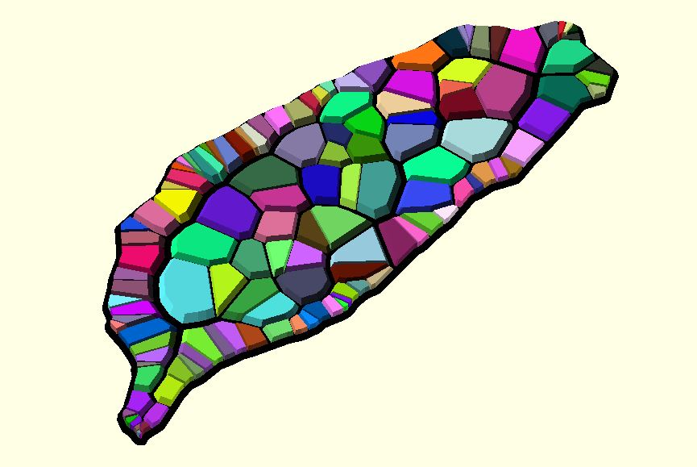

# dotSCAD 3.1 Preview

> **Reduce the burden of mathematics/algorithm when playing OpenSCAD.**

## Introduction

Some of my [3D models](https://github.com/JustinSDK/dotSCAD#examples) require complex mathematics/algorithm. I extract them into dotSCAD. Hope it helps when you're playing OpenSCAD.

The idea of the name dotSCAD comes from the filename extension ".scad" of OpenSCAD. 

## Get Started

OpenSCAD uses three library locations, the installation library, built-in library, and user defined libraries. It's convenient to set `OPENSCADPATH`. Check [Setting OPENSCADPATH](https://en.wikibooks.org/wiki/OpenSCAD_User_Manual/Libraries#Setting_OPENSCADPATH) in [OpenSCAD User Manual/Libraries](https://en.wikibooks.org/wiki/OpenSCAD_User_Manual/Libraries) for details.

**I set `OPENSCADPATH` to the `src` folder of dotSCAD so all examples here start searching modules/functions from `src`.**

Every public module/function is in the .scad whose filename is the same as the module/function name. Here's an example using the `line2d` module: 

	use <line2d.scad>;

	line2d(p1 = [0, 0], p2 = [5, 0], width = 1);

Some modules/functions are organized in a directory. For example, vx_circle.scad exists in `voxel` directory. You have to prefix the directory name when using `vx_circle`.

    use <voxel/vx_circle.scad>;
	
	points = vx_circle(radius = 10);
	for(pt = points) {
        translate(pt) square(1);
	}

## Examples

These examples incubate dotSCAD and dotSCAD refactors these examples. See [examples](examples#dogfooding-examples).

# API Documentation

## 2D Module

 Signature | Description
--|--
[**arc**(radius, angle, width = 1, width_mode = "LINE_CROSS")](https://openhome.cc/eGossip/OpenSCAD/lib3x-arc.html) | create an arc.
[**hexagons**(radius, spacing, levels)](https://openhome.cc/eGossip/OpenSCAD/lib3x-hexagons.html) | create hexagons in a hexagon.
[**hull_polyline2d**(points, width = 1)](https://openhome.cc/eGossip/OpenSCAD/lib3x-hull_polyline2d.html) | create a 2D polyline from a list of `[x, y]`.
[**line2d**(p1, p2, width = 1, p1Style = "CAP_SQUARE", p2Style = "CAP_SQUARE")](https://openhome.cc/eGossip/OpenSCAD/lib3x-line2d.html) | create a line from two points. 
[**multi_line_text**(lines, line_spacing = 15, size = 10, font = "Arial", ...)](https://openhome.cc/eGossip/OpenSCAD/lib3x-multi_line_text.html) | create multi-line text from a list of strings.
[**pie**(radius, angle)](https://openhome.cc/eGossip/OpenSCAD/lib3x-pie.html) | create polyline2de a pie (circular sector).
[**polyline2d**(points, width = 1, startingStyle = "CAP_SQUARE", endingStyle = "CAP_SQUARE", ...)](https://openhome.cc/eGossip/OpenSCAD/lib3x-polyline2d.html) | create a polyline from a list of `[x, y]` coordinates.
[**polygon_hull**(points)](https://openhome.cc/eGossip/OpenSCAD/lib3x-polygon_hull.html) | create a convex polygon by hulling a list of points. It avoids using hull and small 2D primitives to create the polygon.
[**rounded_square**(size, corner_r, center = false)](https://openhome.cc/eGossip/OpenSCAD/lib3x-rounded_square.html) | create a rounded square in the first quadrant.

## 3D Module

 Signature | Description
--|--
[**crystal_ball**(radius, theta = 360, phi = 180, thickness = undef)](https://openhome.cc/eGossip/OpenSCAD/lib3x-crystal_ball.html) | create a crystal ball based on [spherical coordinates (r, θ, φ) used in mathematics](https://en.wikipedia.org/wiki/Spherical_coordinate_system).
[**function_grapher**(points, thickness = 1, style = "FACES")](https://openhome.cc/eGossip/OpenSCAD/lib3x-function_grapher.html) | create the graph of `f(x, y)` from a list of `[x, y, f(x, y)]`.
[**hull_polyline3d**(points, diameter = 1)](https://openhome.cc/eGossip/OpenSCAD/lib3x-hull_polyline3d.html) | create a 3D polyline from a list of `[x, y, z]`.
[**line3d**(p1, p2, diameter = 1, p1Style = "CAP_CIRCLE", p2Style = "CAP_CIRCLE")](https://openhome.cc/eGossip/OpenSCAD/lib3x-line3d.html) | create a 3D line from two points.
[**loft**(sections, slices = 1)](https://openhome.cc/eGossip/OpenSCAD/lib3x-loft.html) | develop a smooth skin between crosssections with different geometries.
[**polyhedron_hull**(points)](https://openhome.cc/eGossip/OpenSCAD/lib3x-polyhedron_hull.html) | create a convex polyhedron by hulling a list of points. It avoids using `hull` and small 3D primitives to create the polyhedron.
[**polyline3d**(points, diameter, startingStyle = "CAP_CIRCLE", endingStyle = "CAP_CIRCLE")](https://openhome.cc/eGossip/OpenSCAD/lib3x-polyline3d.html) | create a polyline from a list of `[x, y, z]`.
[**rounded_cube**(size, corner_r, center = false)](https://openhome.cc/eGossip/OpenSCAD/lib3x-rounded_cube.html) | create a cube in the first octant.
[**rounded_cylinder**(radius, h, round_r, convexity = 2, center = false)](https://openhome.cc/eGossip/OpenSCAD/lib3x-rounded_cylinder.html) | create a rounded cylinder.
[**starburst**(r1, r2, n, height)](https://openhome.cc/eGossip/OpenSCAD/lib3x-starburst.html) | a 3D version of [`shape_starburst`](https://openhome.cc/eGossip/OpenSCAD/lib3x-starburst.html).
[**sweep**(sections, triangles = "SOLID")](https://openhome.cc/eGossip/OpenSCAD/lib3x-sweep.html) | develop a smooth skin from crosssections with the same umber of sides.

## Transformation

 Signature | Description
--|--
[**along_with**(points, angles, twist = 0, scale = 1.0, method = "AXIS_ANGLE")](https://openhome.cc/eGossip/OpenSCAD/lib3x-along_with.html) | put children along the given path. If there's only one child, put the child for each point.
[**bend**(size, angle, frags = 24)](https://openhome.cc/eGossip/OpenSCAD/lib3x-bend.html) | bend a 3D object.
[**hollow_out**(shell_thickness) ](https://openhome.cc/eGossip/OpenSCAD/lib3x-hollow_out.html)| hollow out a 2D object.
[**shear**(sx = [0, 0], sy = [0, 0], sz = [0, 0])](https://openhome.cc/eGossip/OpenSCAD/lib3x-shear.html) | shear all child elements along the X-axis, Y-axis, or Z-axis.

## 2D Function

 Signature | Description
--|--
[**bijection_offset**(pts, d, epsilon = 0.0001)](https://openhome.cc/eGossip/OpenSCAD/lib3x-bijection_offset.html) | move 2D outlines outward or inward by a given amount. Each point of the offsetted shape is paired with exactly one point of the original shape.
[**contours**(points, threshold)](https://openhome.cc/eGossip/OpenSCAD/lib3x-contours.html) | compute contour polygons by applying [marching squares](https://en.wikipedia.org/wiki/Marching_squares) to a rectangular list of numeric values.
[**in_shape**(shapt_pts, pt, include_edge = false, epsilon = 0.0001)](https://openhome.cc/eGossip/OpenSCAD/lib3x-in_shape.html) | check whether a point is inside a shape.
[**trim_shape**(shape_pts, from, to, epsilon = 0.0001)](https://openhome.cc/eGossip/OpenSCAD/lib3x-trim_shape.html) | trim a tangled-edge shape to a non-tangled shape.

## 2D/3D Function

 Signature | Description
--|--
[**angle_between**(vt1, vt2)](https://openhome.cc/eGossip/OpenSCAD/lib3x-angle_between.html) | return the angle between two vectors.
[**bezier_surface**(t_step, ctrl_pts)](https://openhome.cc/eGossip/OpenSCAD/lib3x-bezier_surface.html) | given a set of control points, this function returns points of the Bézier surface.
[**bezier_smooth**(path_pts, round_d, t_step = 0.1, closed = false, angle_threshold = 0)](https://openhome.cc/eGossip/OpenSCAD/lib3x-bezier_smooth.html) | use bazier curves to smooth a path.
[**cross_sections**(shape_pts, path_pts, angles, twist = 0, scale = 1.0)](https://openhome.cc/eGossip/OpenSCAD/lib3x-cross_sections.html) | given a 2D shape, points and angles along the path, this function returns all cross-sections.
[**in_polyline**(line_pts, pt, epsilon = 0.0001)](https://openhome.cc/eGossip/OpenSCAD/lib3x-in_polyline.html) | check whether a point is on a line.
[**lines_intersection**(line1, line2, ext = false, epsilon = 0.0001)](https://openhome.cc/eGossip/OpenSCAD/lib3x-lines_intersection.html) | find the intersection of two line segments. Return `[]` if lines don't intersect.
[**paths2sections**(paths)](https://openhome.cc/eGossip/OpenSCAD/lib3x-paths2sections.html) | given a list of paths, this function returns all cross-sections described by those paths.
[**path_scaling_sections**(shape_pts, edge_path)](https://openhome.cc/eGossip/OpenSCAD/lib3x-path_scaling_sections.html) | given an edge path with the first point at the outline of a shape, this function uses the path to calculate scaling factors and returns all scaled sections in the reversed order of the edge path. 
[**midpt_smooth**(points, n, closed = false)](https://openhome.cc/eGossip/OpenSCAD/lib3x-midpt_smooth.html) | given a 2D path, this function constructs a mid-point smoothed version by joining the mid-points of the lines of the path.

## Path

 Signature | Description
--|--
[**arc_path**(radius, angle)](https://openhome.cc/eGossip/OpenSCAD/lib3x-arc_path.html) | create an arc path.
[**archimedean_spiral**(arm_distance, init_angle, point_distance, num_of_points, rt_dir = "CT_CLK")](https://openhome.cc/eGossip/OpenSCAD/lib3x-archimedean_spiral.html) | get all points and angles on the path of an archimedean spiral. 
[**bauer_spiral**(n, radius = 1, rt_dir = "CT_CLK")](https://openhome.cc/eGossip/OpenSCAD/lib3x-bauer_spiral.html) | create visually even spacing of n points on the surface of the sphere. Successive points will all be approximately the same distance apart.
[**bezier_curve**(t_step, points)](https://openhome.cc/eGossip/OpenSCAD/lib3x-bezier_curve.html) | given a set of control points, this function returns points of the Bézier path.
[**bspline_curve**(t_step, degree, points, knots, weights)](https://openhome.cc/eGossip/OpenSCAD/lib3x-bspline_curve.html) | B-spline interpolation using [de Boor's algorithm](https://en.wikipedia.org/wiki/De_Boor%27s_algorithm). 
[**curve**(t_step, points, tightness = 0)](https://openhome.cc/eGossip/OpenSCAD/lib3x-curve.html) | create a curved path. An implementation of [Centripetal Catmull-Rom spline](https://en.wikipedia.org/wiki/Centripetal_Catmull%E2%80%93Rom_spline). 
[**fibonacci_lattice**(n, radius = 1, dir = "CT_CLK")](https://openhome.cc/eGossip/OpenSCAD/lib3x-fibonacci_lattice.html) | create visually even spacing of n points on the surface of the sphere. Nearest-neighbor points will all be approximately the same distance apart. 
[**golden_spiral**(from, to, point_distance, rt_dir = "CT_CLK")](https://openhome.cc/eGossip/OpenSCAD/lib3x-golden_spiral.html) | get all points and angles on the path of a golden spiral based on Fibonacci numbers. The distance between two points is almost constant.
[**helix**(radius, levels, level_dist, vt_dir = "SPI_DOWN", rt_dir = "CT_CLK")](https://openhome.cc/eGossip/OpenSCAD/lib3x-helix.html) | get all points on the path of a spiral around a cylinder. 
[**sphere_spiral**(radius, za_step, z_circles = 1, begin_angle = 0, end_angle = 0, ...) ](https://openhome.cc/eGossip/OpenSCAD/lib3x-sphere_spiral.html)| create all points and angles on the path of a spiral around a sphere. It returns a vector of `[[x, y, z], [ax, ay, az]]`. 
[**torus_knot**(p, q, phi_step)](https://openhome.cc/eGossip/OpenSCAD/lib3x-torus_knot.html) | generate a path of [The (p,q)-torus knot](https://en.wikipedia.org/wiki/Torus_knot).

## Extrusion

 Signature | Description
--|--
[**bend_extrude**(size, thickness, angle, frags = 24)](https://openhome.cc/eGossip/OpenSCAD/lib3x-bend_extrude.html) | extrude and bend a 2D shape.
[**box_extrude**(height, shell_thickness, bottom_thickness, offset_mode = "delta", chamfer = false, ...)](https://openhome.cc/eGossip/OpenSCAD/lib3x-box_extrude.html) | create a box (container) from a 2D object.
[**ellipse_extrude**(semi_minor_axis, height, center = false, convexity = 10, twist = 0, slices = 20)](https://openhome.cc/eGossip/OpenSCAD/lib3x-ellipse_extrude.html) | extrude a 2D object along the path of an ellipse from 0 to 180 degrees.
[**rounded_extrude**(size, round_r, angle = 90, twist = 0, convexity = 10)](https://openhome.cc/eGossip/OpenSCAD/lib3x-rounded_extrude.html) | extrude a 2D object roundly from 0 to 180 degrees.
[**stereographic_extrude**(shadow_side_leng)](https://openhome.cc/eGossip/OpenSCAD/lib3x-stereographic_extrude.html) | take a 2D polygon as input and extend it onto a sphere.

## 2D Shape

 Signature | Description
--|--
[**shape_arc**(radius, angle, width, width_mode = "LINE_CROSS")](https://openhome.cc/eGossip/OpenSCAD/lib3x-shape_arc.html) | return points on the path of an arc shape.
[**shape_circle**(radius, n)](https://openhome.cc/eGossip/OpenSCAD/lib3x-shape_circle.html) | return points on the path of a circle.
[**shape_cyclicpolygon**(sides, circle_r, corner_r)](https://openhome.cc/eGossip/OpenSCAD/lib3x-shape_cyclicpolygon.html) | return points on the path of a regular cyclic polygon.
[**shape_ellipse**(axes)](https://openhome.cc/eGossip/OpenSCAD/lib3x-shape_ellipse.html) | return points on the path of an ellipse.
[**shape_liquid_splitting**(radius, centre_dist, tangent_angle = 30, t_step = 0.1)](https://openhome.cc/eGossip/OpenSCAD/lib3x-shape_liquid_splitting.html) | return shape points of two splitting liquid shapes, kind of how cells divide. 
[**shape_path_extend**(stroke_pts, path_pts, scale = 1.0, closed = false)](https://openhome.cc/eGossip/OpenSCAD/lib3x-shape_path_extend.html) | extend a 2D stroke along a path to create a 2D shape.
[**shape_pentagram**(r)](https://openhome.cc/eGossip/OpenSCAD/lib3x-shape_pentagram.html) | return shape points of a pentagram.
[**shape_pie**(radius, angle)](https://openhome.cc/eGossip/OpenSCAD/lib3x-shape_pie.html) | return shape points of a pie (circular sector) shape. 
[**shape_square**(size, corner_r = 0)](https://openhome.cc/eGossip/OpenSCAD/lib3x-shape_square.html) | return shape points of a rounded square or rectangle. 
[**shape_starburst**(r1, r2, n)](https://openhome.cc/eGossip/OpenSCAD/lib3x-shape_starburst.html) | returns shape points of a star. 
[**shape_superformula**(phi_step, m1, m2, n1, n2 = 1, n3 = 1, a = 1, b = 1)](https://openhome.cc/eGossip/OpenSCAD/lib3x-shape_superformula.html) | return shape points of [Superformula](https://en.wikipedia.org/wiki/Superformula).
[**shape_taiwan**(h, distance = 0)](https://openhome.cc/eGossip/OpenSCAD/lib3x-shape_taiwan.html) | return shape points of [Taiwan](https://www.google.com.tw/maps?q=taiwan&um=1&ie=UTF-8&sa=X&ved=0ahUKEwjai9XrqurTAhVIopQKHbEHClwQ_AUICygC). 
[**shape_trapezium**(length, h, corner_r = 0)](https://openhome.cc/eGossip/OpenSCAD/lib3x-shape_trapezium.html) | return shape points of an isosceles trapezoid. 

## 2D Shape Extrusion

 Signature | Description
--|--
[**archimedean_spiral_extrude**(shape_pts, arm_distance, init_angle, point_distance, num_of_points, ...)](https://openhome.cc/eGossip/OpenSCAD/lib3x-archimedean_spiral_extrude.html) | extrude a 2D shape along the path of an archimedean spiral.
[**golden_spiral_extrude**(shape_pts, from, to, point_distance, ...)](https://openhome.cc/eGossip/OpenSCAD/lib3x-golden_spiral_extrude.html) | extrude a 2D shape along the path of a golden spiral.
[**helix_extrude**(shape_pts, radius, levels, level_dist, ...)](https://openhome.cc/eGossip/OpenSCAD/lib3x-helix_extrude.html) | extrude a 2D shape along a helix path.
[**path_extrude**(shape_pts, path_pts, ...)](https://openhome.cc/eGossip/OpenSCAD/lib3x-path_extrude.html) | extrude a 2D shape along a path.
[**ring_extrude**(shape_pts, radius, angle = 360, ...)](https://openhome.cc/eGossip/OpenSCAD/lib3x-ring_extrude.html) | rotational extrusion spins a 2D shape around the Z-axis.
[**sphere_spiral_extrude**(shape_pts, radius, za_step, ...)](https://openhome.cc/eGossip/OpenSCAD/lib3x-sphere_spiral_extrude.html) | extrude a 2D shape along the path of a sphere spiral.

## Util

### util/list

 Signature | Description
--|--
[**util/bsearch**(sorted, target)](https://openhome.cc/eGossip/OpenSCAD/lib3x-bsearch.html) | search a value in a list whose elements must be sorted by zyx.
[**util/has**(lt, elem, sorted = false)](https://openhome.cc/eGossip/OpenSCAD/lib3x-has.html) | return `true` if `lt` contains elem.
[**util/find_index**(lt, test)](https://openhome.cc/eGossip/OpenSCAD/lib3x-find_index.html) | return the index of the first element that satisfies the testing function. 
[**util/dedup**(lt, ...)](https://openhome.cc/eGossip/OpenSCAD/lib3x-dedup.html) | eliminate duplicate vectors.
[**util/flat**(lt, depth = 1)](https://openhome.cc/eGossip/OpenSCAD/lib3x-flat.html) | return a new list with all sub-list elements concatenated into it recursively up to the specified depth.
[**util/reverse**(lt)](https://openhome.cc/eGossip/OpenSCAD/lib3x-reverse.html) | reverse a list.
[**util/slice**(lt, begin, end)](https://openhome.cc/eGossip/OpenSCAD/lib3x-slice.html) | return a list selected from `begin` to `end`, or to the `end` of the list (`end` not included).
[**util/sort**(lt, by = "idx", idx = 0)](https://openhome.cc/eGossip/OpenSCAD/lib3x-sort.html) | sort a list.
[**util/sum**(lt)](https://openhome.cc/eGossip/OpenSCAD/lib3x-sum.html) | use `+` to sum up all elements in a list.
[**util/swap**(lt, i, j)](https://openhome.cc/eGossip/OpenSCAD/lib3x-swap.html) | swap two elements in a list.
[**util/zip**(lts, combine)](https://openhome.cc/eGossip/OpenSCAD/lib3x-zip.html) | make a list that aggregates elements from each of the lists.
[**util/every**(lt, test)](https://openhome.cc/eGossip/OpenSCAD/lib3x-every.html) | test whether all elements in the list pass the test implemented by the provided function.
[**util/some**(lt, test)](https://openhome.cc/eGossip/OpenSCAD/lib3x-some.html) | test whether at least one element in the list passes the test implemented by the provided function.

### util/random

 Signature | Description
--|--
[**util/choose**(choices, seed)](https://openhome.cc/eGossip/OpenSCAD/lib3x-choose.html) | choose an element from the given list.
[**util/rand**(min_value = 0, max_value = 1, seed_value = undef)](https://openhome.cc/eGossip/OpenSCAD/lib3x-rand.html) | generate a pseudo random number.
[**util/shuffle**(lt, seed = undef)](https://openhome.cc/eGossip/OpenSCAD/lib3x-shuffle.html) | randomizes the order of the elements.

### util/string

 Signature | Description
--|--
[**util/parse_number**(t)](https://openhome.cc/eGossip/OpenSCAD/lib3x-parse_number.html) | parse the string argument as an number.
[**util/split_str**(t, delimiter)](https://openhome.cc/eGossip/OpenSCAD/lib3x-split_str.html) | split the given string around matches of the given delimiting character.
[**util/sub_str**(t, begin, end)](https://openhome.cc/eGossip/OpenSCAD/lib3x-sub_str.html) | return the part of the string from `begin` to `end`, or to the `end` of the string (`end` not included).

### util/math

 Signature | Description
--|--
[**util/degrees**(radians)](https://openhome.cc/eGossip/OpenSCAD/lib3x-degrees.html) | convert a radian measurement to the corresponding value in degrees.
[**util/radians**(degrees)](https://openhome.cc/eGossip/OpenSCAD/lib3x-radians.html) | convert a degree measurement to the corresponding value in radians.
[**util/polar_coordinate**(point)](https://openhome.cc/eGossip/OpenSCAD/lib3x-polar_coordinate.html) | convert from Cartesian to Polar coordinates.
[**util/spherical_coordinate**(point)](https://openhome.cc/eGossip/OpenSCAD/lib3x-spherical_coordinate.html) | convert from Cartesian to Spherical coordinates (used in mathematics). 
[**util/lerp**(v1, v2, amt)](https://openhome.cc/eGossip/OpenSCAD/lib3x-lerp.html) | linear interpolate the vector v1 to v2.
[**util/fibseq**(from, to)](https://openhome.cc/eGossip/OpenSCAD/lib3x-fibseq.html) | generate a Fibonacci sequence.	

### util/set

 Signature | Description
--|--
[**util/set/hashset**(lt, ...)](https://openhome.cc/eGossip/OpenSCAD/lib3x-hashset.html) | model the mathematical set, backed by a hash table. 
[**util/set/hashset_add**(set, elem, ...)](https://openhome.cc/eGossip/OpenSCAD/lib3x-hashset_add.html) | add an element to a `hashset`.
[**util/set/hashset_has**(set, elem, ...)](https://openhome.cc/eGossip/OpenSCAD/lib3x-hashset_has.html) | return `true` if a `hashset` contains the specified element.
[**util/set/hashset_del**(set, elem, ...)](https://openhome.cc/eGossip/OpenSCAD/lib3x-hashset_del.html) | del an element from a `hashset`.
[**util/set/hashset_len**(set)](https://openhome.cc/eGossip/OpenSCAD/lib3x-hashset_len.html) | return the length of the elements in a `hashset`.
[**util/set/hashset_elems**(set)](https://openhome.cc/eGossip/OpenSCAD/lib3x-hashset_elems.html) | returns a list containing all elements in a `hashset`. No guarantees to the order.

### util/map

 Signature | Description
--|--
[**util/map/hashmap**(kv_lt, ...)](https://openhome.cc/eGossip/OpenSCAD/lib3x-hashmap.html) | map keys to values.
[**util/map/hashmap_put**(map, key, value, ...)](https://openhome.cc/eGossip/OpenSCAD/lib3x-hashmap_put.html) | put a key/value pair to a `hashmap`.
[**util/map/hashmap_get**(map, key, ...)](https://openhome.cc/eGossip/OpenSCAD/lib3x-hashmap_get.html) | get the value of the specified key from a `hashmap`.
[**util/map/hashmap_del**(map, key, ...)](https://openhome.cc/eGossip/OpenSCAD/lib3x-hashmap_del.html) | delete the mapping for the specified key from a `hashmap` if present.
[**util/map/hashmap_len**(map)](https://openhome.cc/eGossip/OpenSCAD/lib3x-hashmap_len.html) | return the length of a `hashmap`.
[**util/map/hashmap_keys**(map)](https://openhome.cc/eGossip/OpenSCAD/lib3x-hashmap_keys.html) | return a list containing all keys in a `hashmap`.
[**util/map/hashmap_values**(map)](https://openhome.cc/eGossip/OpenSCAD/lib3x-hashmap_values.html) | return a list containing all values in a `hashmap`.
[**util/map/hashmap_entries**(map)](https://openhome.cc/eGossip/OpenSCAD/lib3x-hashmap_entries.html) | return a list containing all `[key, value]`s in a `hashmap`.

## Matrix

 Signature | Description
--|--
[**matrix/m_determinant**(m)](https://openhome.cc/eGossip/OpenSCAD/lib3x-m_determinant.html) | calculate a determinant of a square matrix.
[**matrix/m_mirror**(v)](https://openhome.cc/eGossip/OpenSCAD/lib3x-m_mirror.html) | generate a transformation matrix which can pass into `multmatrix` to mirror the child element on a plane through the origin.
[**matrix/m_rotation**(a, v)](https://openhome.cc/eGossip/OpenSCAD/lib3x-m_rotation.html) | Generate a transformation matrix which can pass into `multmatrix` to rotate the child element about the axis of the coordinate system or around an arbitrary axis.
[**matrix/m_scaling**(s)](https://openhome.cc/eGossip/OpenSCAD/lib3x-m_scaling.html) | generate a transformation matrix which can pass into `multmatrix` to scale its child elements using the specified vector.
[**matrix/m_shearing**(sx = [0, 0], sy = [0, 0], sz = [0, 0])](https://openhome.cc/eGossip/OpenSCAD/lib3x-m_shearing.html) | generate a transformation matrix which can pass into `multmatrix` to shear all child elements along the X-axis, Y-axis, or Z-axis in 3D.
[**matrix/m_translation**(v)](https://openhome.cc/eGossip/OpenSCAD/lib3x-m_translation.html) | generate a transformation matrix which can pass into multmatrix to translates (moves) its child elements along the specified vector.
[**maxtrix/m_transpose**(m)](https://openhome.cc/eGossip/OpenSCAD/lib3x-m_transpose.html) | transpose a matrix.

## Point Transformation

 Signature | Description
--|--
[**ptf/ptf_bend**(size, point, radius, angle)](https://openhome.cc/eGossip/OpenSCAD/lib3x-ptf_bend.html) | transform a point inside a rectangle to a point of an arc.
[**ptf/ptf_circle**(size, point)](https://openhome.cc/eGossip/OpenSCAD/lib3x-ptf_circle.html) | transform a point inside a rectangle to a point inside a circle. 
[**ptf/ptf_ring**(size, point, radius, angle = 360, twist = 0)](https://openhome.cc/eGossip/OpenSCAD/lib3x-ptf_ring.html) | transform a point inside a rectangle to a point of a ring. 
[**ptf/ptf_rotate**(point, a, v)](https://openhome.cc/eGossip/OpenSCAD/lib3x-ptf_rotate.html) | rotate a point a degrees around the axis of the coordinate system or an arbitrary axis.
[**ptf/ptf_sphere**(size, point, radius, angle = [180, 360])](https://openhome.cc/eGossip/OpenSCAD/lib3x-ptf_sphere.html) | transform a point inside a rectangle to a point of a sphere.
[**ptf/ptf_torus**(size, point, radius, angle = [360, 360], twist = 0)](https://openhome.cc/eGossip/OpenSCAD/lib3x-ptf_torus.html) | transform a point inside a rectangle to a point of a torus.
[**ptf/ptf_x_twist**(size, point, angle)](https://openhome.cc/eGossip/OpenSCAD/lib3x-ptf_x_twist.html) | twist a point along the x-axis.
[**ptf/ptf_y_twist**(size, point, angle)](https://openhome.cc/eGossip/OpenSCAD/lib3x-ptf_y_twist.html) | twist a point along the y-axis.

## Triangle

 Signature | Description
--|--
[**triangle/tri_circumcenter**(shape_pts)](https://openhome.cc/eGossip/OpenSCAD/lib3x-tri_circumcenter.html) | return the circumcenter of a triangle.
[**triangle/tri_incenter**(shape_pts)](https://openhome.cc/eGossip/OpenSCAD/lib3x-tri_incenter.html) | return the incenter of a triangle.
[**triangle/tri_ear_clipping**(shape_pts,  ret = "TRI_INDICES", ...)](https://openhome.cc/eGossip/OpenSCAD/lib3x-tri_ear_clipping.html) | triangulation by [ear clipping](https://en.wikipedia.org/wiki/Polygon_triangulation#Ear_clipping_method).
[**triangle/tri_delaunay**(points, ret = "TRI_INDICES")](https://openhome.cc/eGossip/OpenSCAD/lib3x-tri_delaunay.html) | Join a set of points to make a [Delaunay triangulation](https://en.wikipedia.org/wiki/Delaunay_triangulation).
[**triangle/tri_delaunay_indices**(d)](https://openhome.cc/eGossip/OpenSCAD/lib3x-tri_delaunay_indices.html) | return triangle indices from a delaunay object.
[**triangle/tri_delaunay_shapes**(d)](https://openhome.cc/eGossip/OpenSCAD/lib3x-tri_delaunay_shapes.html) | return triangle shapes from a delaunay object.
[**triangle/tri_delaunay_voronoi**(d)](https://openhome.cc/eGossip/OpenSCAD/lib3x-tri_delaunay_voronoi.html) | return [Voronoi](https://en.wikipedia.org/wiki/Voronoi_diagram) cells from a delaunay object.

----

## Turtle

 Signature | Description
--|--
[**turtle/footprints2**(cmds, start = [0, 0])](https://openhome.cc/eGossip/OpenSCAD/lib3x-footprints2.html) | drive a turtle with `["forward", length]` or `["turn", angle]`. This function is intended to use a turtle to imitate freehand drawing.
[**turtle/footprints3**(cmds, start = [0, 0, 0])](https://openhome.cc/eGossip/OpenSCAD/lib3x-footprints3.html) | a 3D verion of `footprint2`.
[**turtle/lsystem2**(axiom, rules, n, angle, leng = 1, heading = 0, ...)](https://openhome.cc/eGossip/OpenSCAD/lib3x-lsystem2.html) | 2D implementation of [L-system](https://en.wikipedia.org/wiki/L-system).
[**turtle/lsystem3**(axiom, rules, n, angle, leng = 1, heading = 0, ...)](https://openhome.cc/eGossip/OpenSCAD/lib3x-lsystem3.html) | 3D implementation of [L-system](https://en.wikipedia.org/wiki/L-system).
[**turtle/t2d**(t, cmd, point, angle, leng)](https://openhome.cc/eGossip/OpenSCAD/lib3x-t2d.html) | an implementation of Turtle Graphics.
[**turtle/t3d**(t, cmd, point, unit_vectors, leng, angle)](https://openhome.cc/eGossip/OpenSCAD/lib3x-t3d.html) | a 3D version of `t2d`.

## Voxel

 Signature | Description
--|--
[**voxel/vx_ascii**(char, center = false, invert = false)](https://openhome.cc/eGossip/OpenSCAD/lib3x-vx_ascii.html) | generate 8x8 voxel points of printable ASCII characters (codes 32dec to 126dec).
[**voxel/vx_bezier**(p1, p2, p3, p4)](https://openhome.cc/eGossip/OpenSCAD/lib3x-vx_bezier.html) | return voxel-by-voxel points of Bézier Curve.
[**voxel/vx_circle**(radius, filled = false)](https://openhome.cc/eGossip/OpenSCAD/lib3x-vx_circle.html) | return points that can be used to draw a voxel-style circle.
[**voxel/vx_contour**(points, sorted = false)](https://openhome.cc/eGossip/OpenSCAD/lib3x-vx_contour.html) | return the contour which encircles the area.
[**voxel/vx_curve**(points, tightness = 0)](https://openhome.cc/eGossip/OpenSCAD/lib3x-vx_curve.html) | the curve is drawn only from the 2nd control point to the second-last control point.
[**voxel/vx_cylinder**(r, h, filled = false, thickness = 1)](https://openhome.cc/eGossip/OpenSCAD/lib3x-vx_cylinder.html) | return points that can be used to draw a voxel-style cylinder.
[**voxel/vx_difference**(points1, points2)](https://openhome.cc/eGossip/OpenSCAD/lib3x-vx_difference.html) | create a difference of two lists of points.
[**voxel/vx_from**(binaries, center = false, invert = false)](https://openhome.cc/eGossip/OpenSCAD/lib3x-vx_from.html) | given a list of 0s and 1s that represent a black-and-white image. This function translates them into voxel points.
[**voxel/vx_gray**(levels, center = false, invert = false, normalize = false)](https://openhome.cc/eGossip/OpenSCAD/lib3x-vx_gray.html) | given a list of numbers (0 ~ 255) that represent a gray image. This function translates them into a list of `[x, y, level]`s.
[**voxel/vx_intersection**(points1, points2)](https://openhome.cc/eGossip/OpenSCAD/lib3x-vx_intersection.html) | create an intersection of two lists of points.
[**voxel/vx_line**(p1, p2)](https://openhome.cc/eGossip/OpenSCAD/lib3x-vx_line.html) | given two points. it returns points that can be used to draw a voxel-style line.
[**voxel/vx_polygon**(points, filled = false)](https://openhome.cc/eGossip/OpenSCAD/lib3x-vx_polygon.html) | return points that can be used to draw a voxel-style polygon.
[**voxel/vx_polyline**(points)](https://openhome.cc/eGossip/OpenSCAD/lib3x-vx_polyline.html) | return points that can be used to draw a voxel-style polyline.
[**voxel/vx_sphere**(radius, filled = false, thickness = 1)](https://openhome.cc/eGossip/OpenSCAD/lib3x-vx_sphere.html) | return points that can be used to draw a voxel-style sphere.
[**voxel/vx_union**(points1, points2)](https://openhome.cc/eGossip/OpenSCAD/lib3x-vx_union.html) | create a union of two lists of points.

## Part

 Signature | Description
--|--
[**part/cone**(radius, length = 0, spacing = 0.5, angle = 50, void = false, ends = false)](https://openhome.cc/eGossip/OpenSCAD/lib3x-cone.html) | create a cone for rotatable models.
[**part/connector_peg**(radius, height, spacing = 0.5, void = false, ends = false)](https://openhome.cc/eGossip/OpenSCAD/lib3x-connector_peg.html) | create a connector peg.
[**part/joint_T**(shaft_r, shaft_h, t_leng, thickness, spacing = 0.5, center = false)](https://openhome.cc/eGossip/OpenSCAD/lib3x-joint_T.html) | create a joint_T for rotatable models.

## Surface

 Signature | Description
--|--
[**surface/sf_bend**(levels, radius, thickness, depth, angle = 180, invert = false)](https://openhome.cc/eGossip/OpenSCAD/lib3x-sf_bend.html) | bend a photo.
[**surface/sf_ring**(levels, radius, thickness, depth, angle = 360, twist = 0, invert = false)](https://openhome.cc/eGossip/OpenSCAD/lib3x-sf_ring.html) | turn a photo into a ring.
[**surface/sf_solidify**(surface1, surface2, slicing = "SLASH")](https://openhome.cc/eGossip/OpenSCAD/lib3x-sf_solidify.html) | solidify two square surfaces.
[**surface/sf_sphere**(levels, radius, thickness, depth, angle = [180, 360], invert = false)](https://openhome.cc/eGossip/OpenSCAD/lib3x-sf_sphere.html) | map a photo onto a sphere.
[**surface/sf_square**(levels, thickness, depth, x_twist = 0, y_twist = 0, invert = false)](https://openhome.cc/eGossip/OpenSCAD/lib3x-sf_square.html) | turn a photo into a twistable square.
[**surface/sf_torus**(levels, radius, thickness, depth, angle = [360, 360], twist = 0, invert = false)](https://openhome.cc/eGossip/OpenSCAD/lib3x-sf_torus.html) | turn a photo to a torus.
[**surface/sf_curve**(levels, curve_path, ...)](https://openhome.cc/eGossip/OpenSCAD/lib3x-sf_curve.html) | curve a photo.
[**surface/sf_splines**(ctrl_pts, row_spline, column_spline)](https://openhome.cc/eGossip/OpenSCAD/lib3x-sf_splines.html) | generalized-spline surface.
[**surface/sf_thicken**(points, thickness, ...)](https://openhome.cc/eGossip/OpenSCAD/lib3x-sf_thicken.html) | thicken a surface.
[**surface/sf_solidifyT**(points1, points2, triangles)](https://openhome.cc/eGossip/OpenSCAD/lib3x-sf_solidifyT.html) | solidify two surfaces with triangular mesh.
[**surface/sf_thickenT**(points, thickness, ...)](https://openhome.cc/eGossip/OpenSCAD/lib3x-sf_thickenT.html) | thicken a surface with triangular mesh.

## Noise

 Signature | Description
--|--
[**noise/nz_cell**(points, p, dist = "euclidean")](https://openhome.cc/eGossip/OpenSCAD/lib3x-nz_cell.html) | an implementation of [Worley noise](https://en.wikipedia.org/wiki/Worley_noise).
[**noise/nz_perlin1**(x, seed = undef)](https://openhome.cc/eGossip/OpenSCAD/lib3x-nz_perlin1.html) | return the 1D [Perlin noise](https://en.wikipedia.org/wiki/Perlin_noise) value at the x coordinate.
[**noise/nz_perlin1s**(xs, seed = undef)](https://openhome.cc/eGossip/OpenSCAD/lib3x-nz_perlin1s.html) | return 1D [Perlin noise](https://en.wikipedia.org/wiki/Perlin_noise) values at x coordinates.
[**noise/nz_perlin2**(x, y, seed = undef)](https://openhome.cc/eGossip/OpenSCAD/lib3x-nz_perlin2.html) | return the 2D [Perlin noise](https://en.wikipedia.org/wiki/Perlin_noise) value at the (x, y) coordinate.
[**noise/nz_perlin2s**(points, seed = undef)](https://openhome.cc/eGossip/OpenSCAD/lib3x-nz_perlin2s.html) | return 2D [Perlin noise](https://en.wikipedia.org/wiki/Perlin_noise) values at (x, y) coordinates.
[**noise/nz_perlin3**(x, y, z, seed = undef)](https://openhome.cc/eGossip/OpenSCAD/lib3x-nz_perlin3.html) | return the 3D [Perlin noise](https://en.wikipedia.org/wiki/Perlin_noise) value at the (x, y, z) coordinate.
[**noise/nz_perlin3s**(points, seed = undef)](https://openhome.cc/eGossip/OpenSCAD/lib3x-nz_perlin3s.html) | return 3D [Perlin noise](https://en.wikipedia.org/wiki/Perlin_noise) values at (x, y, z) coordinates.
[**noise/nz_worley2**(x, y, seed = undef, grid_w = 10, dist = "euclidean")](https://openhome.cc/eGossip/OpenSCAD/lib3x-nz_worley2.html) | return the 2D [Worley noise](https://en.wikipedia.org/wiki/Worley_noise) value at the (x, y) coordinate.
[**noise/nz_worley2s**(points, seed = undef, grid_w = 10, dist = "euclidean")](https://openhome.cc/eGossip/OpenSCAD/lib3x-nz_worley2s.html) | return 2D [Worley noise](https://en.wikipedia.org/wiki/Worley_noise) values at (x, y) coordinates.
[**noise/nz_worley3**(x, y, z, seed = undef, tile_w = 10, dist = "euclidean")](https://openhome.cc/eGossip/OpenSCAD/lib3x-nz_worley3.html) | return the 3D [Worley noise](https://en.wikipedia.org/wiki/Worley_noise) value at the (x, y, z) coordinate.
[**noise/nz_worley3s**(points, seed = undef, tile_w = 10, dist = "euclidean")](https://openhome.cc/eGossip/OpenSCAD/lib3x-nz_worley3s.html) | return 3D [Worley noise](https://en.wikipedia.org/wiki/Worley_noise) values at (x, y, z) coordinates.

## Voronoi

 Signature | Description
--|--
[**voronoi/vrn2_cells_from**(points)](https://openhome.cc/eGossip/OpenSCAD/lib3x-vrn2_cells_from.html) | create cell shapes of [Voronoi](https://en.wikipedia.org/wiki/Voronoi_diagram) from a list of points.
[**voronoi/vrn2_cells_space**(size, grid_w, seed = undef)](https://openhome.cc/eGossip/OpenSCAD/lib3x-vrn2_cells_space.html) | create cell shapes of [Voronoi](https://en.wikipedia.org/wiki/Voronoi_diagram) in the first quadrant.
[**voronoi/vrn2_from**(points, spacing = 1, ...)](https://openhome.cc/eGossip/OpenSCAD/lib3x-vrn2_from.html) | create a [Voronoi](https://en.wikipedia.org/wiki/Voronoi_diagram) from a list of points.
[**voronoi/vrn2_space**(size, grid_w, seed = undef, spacing = 1, ...)](https://openhome.cc/eGossip/OpenSCAD/lib3x-vrn2_space.html) | create a [Voronoi](https://en.wikipedia.org/wiki/Voronoi_diagram) in the first quadrant.
[**voronoi/vrn3_from**(points, spacing = 1)](https://openhome.cc/eGossip/OpenSCAD/lib3x-vrn3_from.html) | create a 3D version of [Voronoi](https://en.wikipedia.org/wiki/Voronoi_diagram).
[**voronoi/vrn3_space**(size, grid_w, seed = undef, spacing = 1)](https://openhome.cc/eGossip/OpenSCAD/lib3x-vrn3_space.html) | create a [Voronoi](https://en.wikipedia.org/wiki/Voronoi_diagram) in the first octant. 

## Maze

 Signature | Description
--|--
[**maze/mz_square_cells**(rows, columns, start = [0, 0], ...)](https://openhome.cc/eGossip/OpenSCAD/lib3x-mz_square_cells.html) | return cell data of a square maze.
[**maze/mz_square_get**(cell, query)](https://openhome.cc/eGossip/OpenSCAD/lib3x-mz_square_get.html) | a helper for getting data from a square-maze cell.
[**maze/mz_square_walls**(cells, rows, columns, cell_width, ...)](https://openhome.cc/eGossip/OpenSCAD/lib3x-mz_square_walls.html) | a helper for creating square wall data from maze cells.
[**maze/mz_hex_walls**(cells, rows, columns, cell_radius, ...)](https://openhome.cc/eGossip/OpenSCAD/lib3x-mz_hex_walls.html) | a helper for creating hex wall data from maze cells.
[**maze/mz_square_initialize**(rows, columns, mask)](https://openhome.cc/eGossip/OpenSCAD/lib3x-mz_square_initialize.html) | a helper for initializing cell data of a maze.
[**maze/mz_hamiltonian**(rows, columns, start = [0, 0], seed = undef)](https://openhome.cc/eGossip/OpenSCAD/lib3x-mz_hamiltonian.html) | create a hamiltonian path from a maze.
[**maze/mz_theta_cells**(rows, beginning_number, start = [0, 0], seed = undef)](https://openhome.cc/eGossip/OpenSCAD/lib3x-mz_theta_cells.html) | return cell data of a theta maze.
[**maze/mz_theta_get**(cell, query)](https://openhome.cc/eGossip/OpenSCAD/lib3x-mz_theta_get.html) | a helper for getting data from a theta-maze cell.
