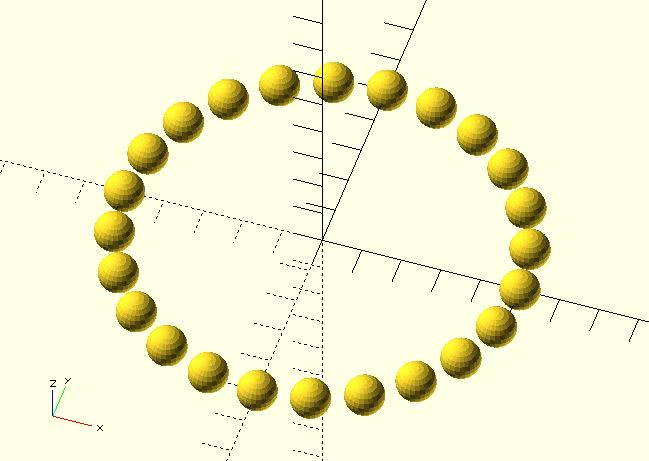
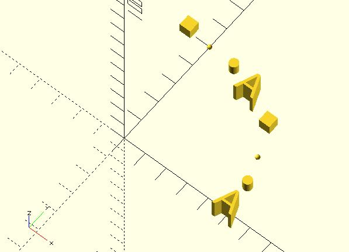
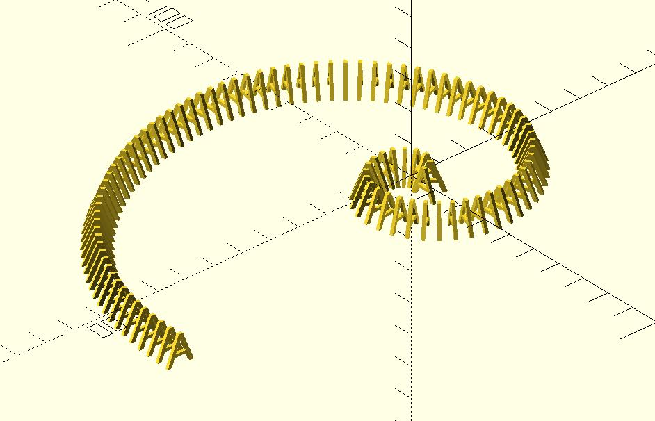
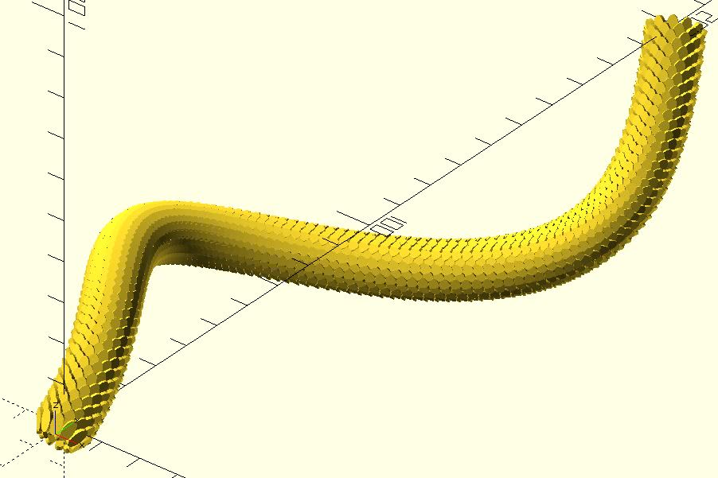

# along_with

Puts children along the given path. If there's only one child, it will put the child for each point. 

## Parameters

- `points` : The points along the path. 
- `angles` : Rotate before translate each child. If not given, `angles` will be calculated automatically according to `points`.

## Examples

	include <along_with.scad>;
	include <circle_path.scad>;
	
	$fn = 24;
	
	points = circle_path(radius = 50);
	
	along_with(points) 
	    sphere(5, center = true);

	include <along_with.scad>;
	include <circle_path.scad>;

	$fn = 24;

	points = circle_path(radius = 50);

	along_with(points) {
		linear_extrude(10, center = true) text("A", valign = "center", halign = "center");
		linear_extrude(5, center = true) circle(2);
		sphere(1);
		cube(5);
		linear_extrude(10, center = true) text("A", valign = "center", halign = "center");
		linear_extrude(5, center = true) circle(2);
		sphere(1);
		cube(5);        
	}

	include <along_with.scad>;
	include <circle_path.scad>;
	include <rotate_p.scad>;
	include <golden_spiral.scad>;

	pts_angles = golden_spiral(
		from = 5, 
		to = 11, 
		point_distance = 4
	);

	points = [for(p_a = pts_angles) p_a[0]];
	angles = [for(p_a = pts_angles) p_a[1]];

	along_with(points, angles)
		rotate([90, 0, 0]) 
			linear_extrude(1, center = true) 
				text("A", valign = "center", halign = "center");

	include <bezier_curve.scad>;
	include <along_with.scad>;

	module scales() {
		module one_scale() {
			rotate([0, 60, 0]) 
				linear_extrude(1, center = true) 
					scale([2, 1]) 
						circle(1.25, $fn = 24);    
		}
		
		for(a = [0:30:360 - 15]) {
			rotate(a) 
				translate([5, 0, 0]) 
					one_scale();
			rotate(a + 15) 
				translate([5, 0, 1.75]) 
					one_scale();
		}

	}

	t_step = 0.01;

	p0 = [0, 0, 0];
	p1 = [0, 50, 35];
	p2 = [-100, 70, 0];
	p3 = [30, 120, -35];
	p4 = [30, 150, -40];
	p5 = [0, 200, -3];

	path_pts = bezier_curve(t_step, 
		[p0, p1, p2, p3, p4, p5]
	);

	along_with(path_pts)  
		scales();

