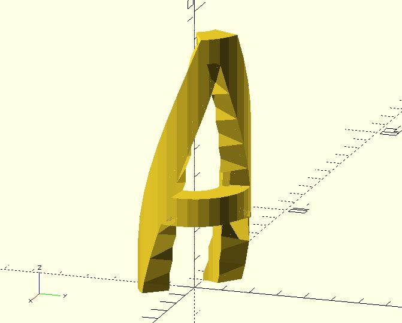

# bend

Bend a 3D object into an arc shape.

## Parameters

- `size` : The size of a cube which can contain the target object.
- `angle` : The central angle of the arc shape. The radius of the arc is calculated automatically.
- `fn` : Number of fragments. The target object will be cut into `fn` fragments and recombined into an arc shape.

## Examples

The containing cube of the target object should be laid down on the x-y plane. For examples.

	x = 9.25;
	y = 9.55;
	z = 1;  
	       
	%cube(size = [x, y, z]);
	linear_extrude(z) text("A");

Once you have the size of the containing cube, you can use it as the `size` argument of the `bend` module.

	x = 9.25;
	y = 9.55;
	z = 1;  
	       
	*cube(size = [x, y, z]);
	
	bend(size = [x, y, z], angle = 270)
	    linear_extrude(z) text("A");

The arc shape is smoother if the `frags` is larger. 
	
	x = 9.25;
	y = 9.55;
	z = 1;  
	
	bend(size = [x, y, z], angle = 270, frags = 360)
	    linear_extrude(z) 
	        text("A");

This module is especially useful when you want to create things such as [zentangle bracelet](https://www.thingiverse.com/thing:1569263).

