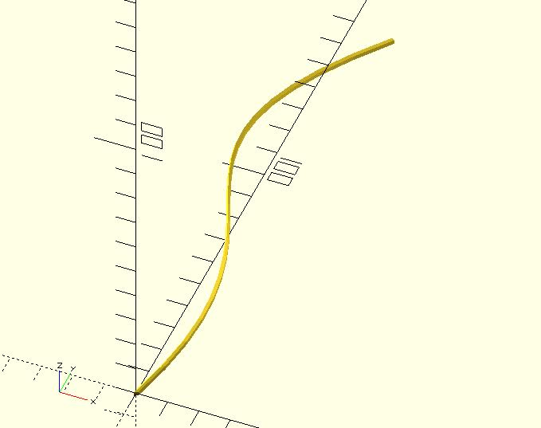

# bezier

Given a set of control points, the bezier function returns points of the Bézier path. Combined with the `polyline`, `polyline3d` or `hull_polyline3d` module defined in my lib-openscad, you can create a Bézier curve.

## Parameters

- `t_step` : The distance between two points of the Bézier path.
- `points` : A set of `[x, y, z]` control points.

## Examples

If you have four control points and combine with the `hull_polyline3d` module:

    include <bezier.scad>;

	t_step = 0.05;
	width = 2;
	
	p0 = [0, 0, 0];
	p1 = [40, 60, 35];
	p2 = [-50, 90, 0];
	p3 = [0, 200, -35];
	
	points = bezier(t_step, 
	    [p0, p1, p2, p3]
	);
	
	hull_polyline3d(points, width);      

