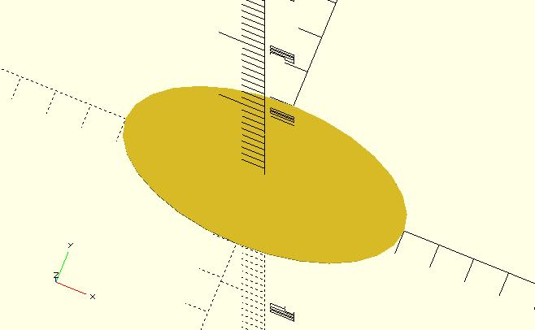
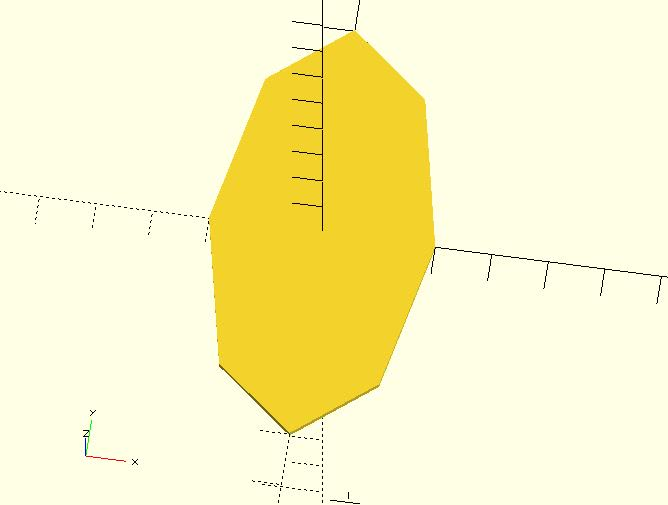

# ellipse

Creates an ellipse. 

## Parameters

- `axes` : 2 element vector `[x, y]` where x is the semi-major axis and y is the semi-minor axis.
- `$fa`, `$fs`, `$fn` : The shape created by this module can be viewd as `resize([x, y]) circle(r = x)` (but not the real implementation inside the module) so you can use these global variables to control it. Check [the circle module](https://en.wikibooks.org/wiki/OpenSCAD_User_Manual/Using_the_2D_Subsystem#circle) for more details. 

## Examples

	include <ellipse.scad>;
	
	ellipse([40, 20]);

	include <ellipse.scad>;
	
	$fn = 8;
	ellipse([20, 40]);

