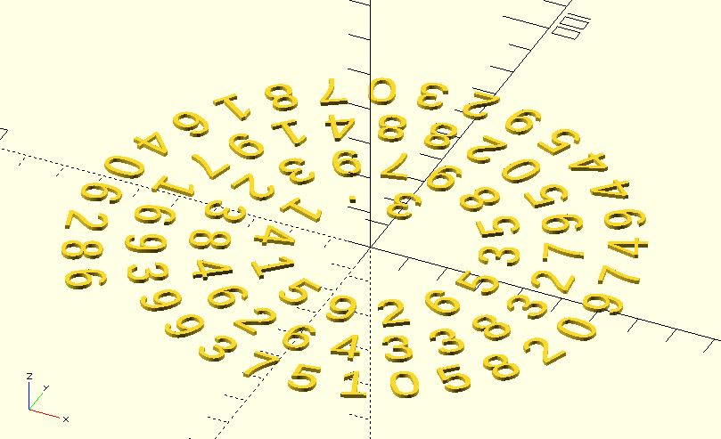

# golden_spiral

Gets all points and angles on the path of a golden spiral. The distance between two  points is almost constant. 

It returns a vector of `[[x, y], angle]`. 

## Parameters

- `from` : If any ray from the origin intersects two successive turnings of the spiral, we'll have two points. The `arm_distance` is the distance between these two points.
- `to` : In polar coordinates `(r, θ)` Archimedean spiral can be described by the equation `r = bθ ` where `θ` is measured in radians. For being consistent with OpenSCAD, the function here use degrees. The `init_angle` is which angle the first point want to start.
- `point_distance` : Distance between two points on the path.
- `rt_dir` : `"CT_CLK"` for counterclockwise. `"CLK"` for clockwise. The default value is `"CT_CLK"`.

## Examples
    
	include <polyline2d.scad>;
    include <archimedean_spiral.scad>;
	
	points_angles = archimedean_spiral(
	    arm_distance = 10,
	    init_angle = 180,
	    point_distance = 5,
	    num_of_points = 100 
	); 
	
	points = [for(pa = points_angles) pa[0]];
	
	polyline2d(points, width = 1);

	
    include <archimedean_spiral.scad>;
    
	points_angles = archimedean_spiral(
	    arm_distance = 10,  
	    init_angle = 180, 
	    point_distance = 5,
	    num_of_points = 100 
	); 
	
	for(pa = points_angles) {
	    translate(pa[0]) 
	        circle(2);
	}

    include <archimedean_spiral.scad>;
    
    t = "3.141592653589793238462643383279502884197169399375105820974944592307816406286";

	points = archimedean_spiral(
	    arm_distance = 15,
	    init_angle = 450, 
	    point_distance = 12, 
	    num_of_points = len(t) 
	); 
	
	for(i = [0: len(points) - 1]) {
	    translate(points[i][0])          
	        rotate(points[i][1] + 90)  
	            text(t[i], valign = "center", halign = "center");
	}

