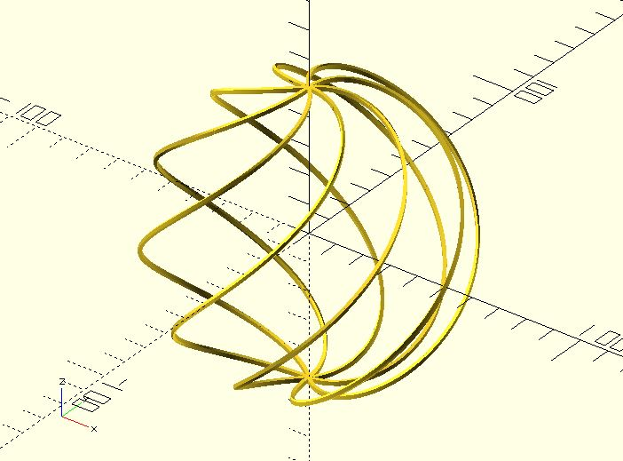

# hull_polyline3d

Creates a 3D polyline from a list of `[x, y, z]` coordinates. As the name says, it uses the built-in hull operation for each pair of points (created by the `sphere` module). It's slow. However, it can be used to create metallic effects for a small `$fn`, large `$fa` or `$fs`.

## Parameters

- `points` : The list of `[x, y, z]` points of the polyline. The points are indexed from 0 to n-1.
- `thickness` : The line thickness.
- `$fa`, `$fs`, `$fn` : Check [the sphere module](https://en.wikibooks.org/wiki/OpenSCAD_User_Manual/Primitive_Solids#sphere) for more details.

## Examples

    include <hull_polyline3d.scad>;

	hull_polyline3d(
	    points = [
	        [1, 2, 3], 
	        [4, -5, -6], 
	        [-1, -3, -5], 
	        [0, 0, 0]
	    ], 
	    thickness = 1, 
	    $fn = 3
	);

    include <hull_polyline3d.scad>;
    
	r = 50;
	points = [
	    for(a = [0:180]) 
	        [
	           r * cos(-90 + a) * cos(a), 
	           r * cos(-90 + a) * sin(a), 
	           r * sin(-90 + a)
	        ]
	];
	
	for(i = [0:7]) {
	    rotate(45 * i) 
	        hull_polyline3d(points, 2, $fn = 3);
	}

