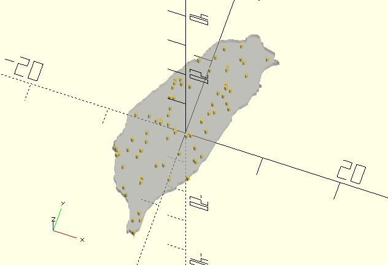

# in_shape

Checks wether a point is inside a shape.

**Since:** 1.3

## Parameters

- `shapt_pts` : The shape points.
- `pt` : The point to be checked.
- `include_edge` : If a point is on the edge of the shape, the function is default to return `false`. If `include_edge` is `true`, the function returns `true`.
- `epsilon` : An upper bound on the relative error due to rounding in floating point arithmetic. Default to 0.0001.

## Examples

    include <shape_taiwan.scad>;
    include <in_shape.scad>;

    points = shape_taiwan(30);

    %polygon(points);

    n = 200;
    xs = rands(-9, 9, n);
    ys = rands(-16, 16, n);

    pts = [
        for(i = [0:n]) 
            let(p = [xs[i], ys[i]]) 
            if(in_shape(points, p, true))
            p
        ]; 

    for(p = pts) {
        translate(p) 
            circle(.2); 
    }

