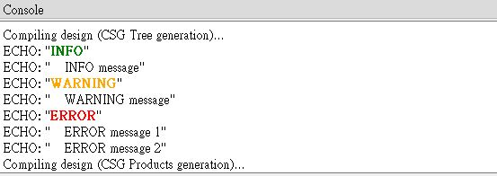
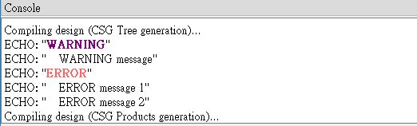

# log

A log module which supports simple level configurations and color titles. 

## Parameters

- `$log_level` : The accepted values are `"OFF"` (-1), `"INFO"` (20), 
   `"WARNING"` (30), `"ERROR"` (40) or positive integers. The default value is `"INFO"`.
- `level` : The accepted values are `"OFF"` (-1), `"INFO"` (20), 
   `"WARNING"` (30), `"ERROR"` (40) or positive integers. If the value is greater or equal to `$log_level`, the `echo` message will display in the console.
- `level_color` : Controls the color of level title. It accepts the same values as the CSS `color` property. 

## Examples

	include <log.scad>;
	
	log() 
	    echo("    INFO message");
	    
	log("WARNING")
	    echo("    WARNING message"); 
	
	log("ERROR") {
	    echo("    ERROR message 1"); 
	    echo("    ERROR message 2"); 
	}

	include <log.scad>;
	
	$log_level = "WARNING";
	
	log() 
	    echo("    INFO message");
	    
	log("WARNING", "purple")
	    echo("    WARNING message"); 
	
	log("ERROR", "rgb(255, 100, 100)") {
	    echo("    ERROR message 1"); 
	    echo("    ERROR message 2"); 
	}

