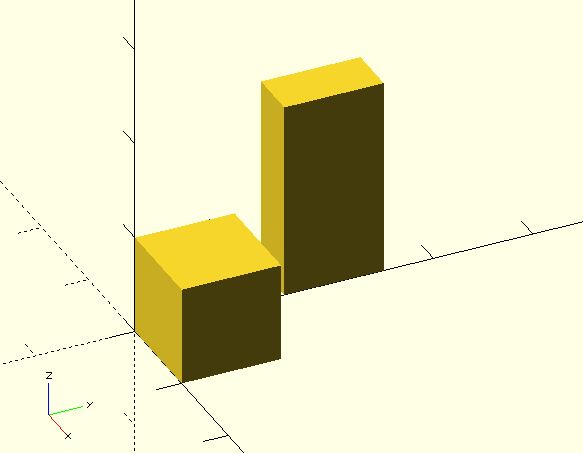

# m_multiply

Multiply two 4x4 transformation matrice.

**Since:** 1.1

## Parameters

- `ma`, `mb` : Two 4x4 transformation matrice.

## Examples

	include <m_multiply.scad>;
	include <m_scaling.scad>;
	include <m_rotation.scad>;

	ma = m_scaling([0.5, 1, 2]);
	mb = m_rotation([0, 0, 90]);

	cube(10);
	multmatrix(m_multiply(ma, mb))
		translate([15, 0, 0])  cube(10);

