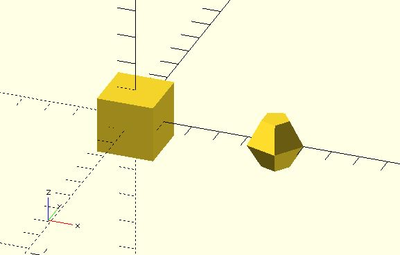

# m_translation

Generate a 4x4 transformation matrix which can pass into `multmatrix` to translates (moves) its child elements along the specified vector.

## Parameters

- `v` : The normal vector of a plane intersecting the origin through which to mirror the object.

## Examples

	include <m_translation.scad>;

	cube(2, center = true); 
	multmatrix(m_translation([5, 0, 0]))
	sphere(1,center = true);

