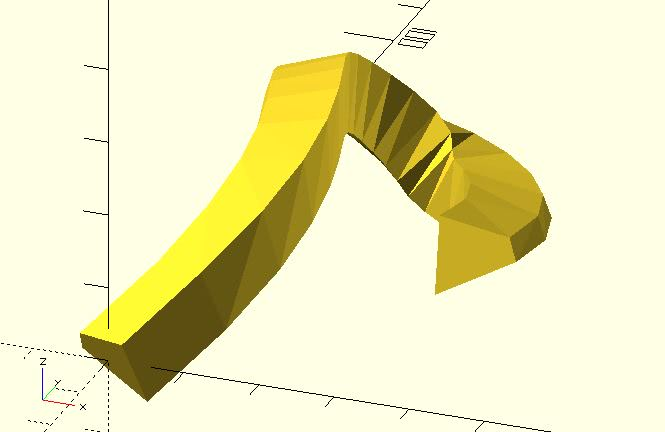
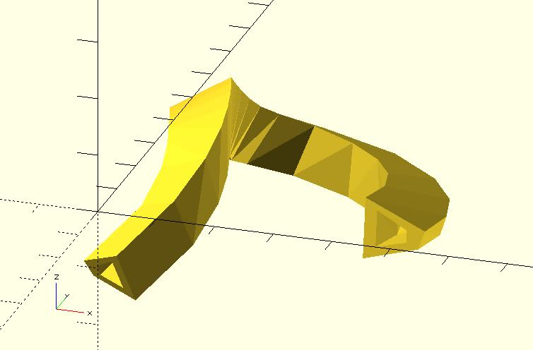
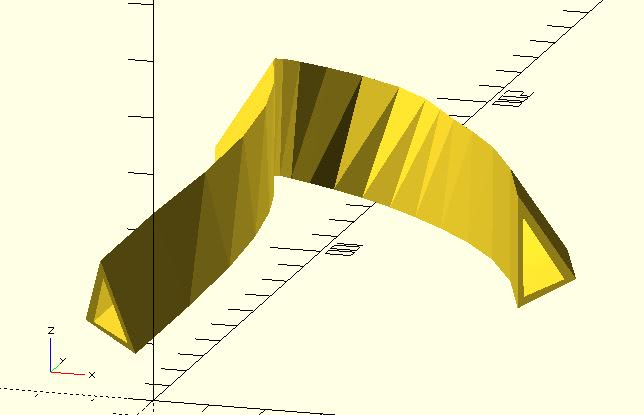

# path_extrude

It extrudes a 2D shape along a path. This module is suitable for a path created by a continuous function.

It depends on the rotate_p function and the polysections module. Remember to include "rotate_p.scad" and "polysections.scad".

When using this module, you should use points to represent the 2D shape. You need to provide indexes of triangles, too. This module provides two prepared triangles indexes. One is `"RADIAL"`. See [polysections](https://openhome.cc/eGossip/OpenSCAD/lib-polysections.html) for details.

## Parameters

- `shape_pts` : A list of points represent a shape. See the example below.
- `path_pts` : A list of points represent the path.
- `triangles` : `"RADIAL"` (default), `"HOLLOW"` or user-defined indexes. See example below.
- `twist` : The number of degrees of through which the shape is extruded.
- `scale` : Scales the 2D shape by this value over the length of the extrusion. Scale can be a scalar or a vector.
- `round_robin` : If the first point and the last point of `path_pts` has the same coordinate, setting `round_robin` to `true` will connect them automatically.

## Examples

	include <rotate_p.scad>;
	include <polysections.scad>;
	include <path_extrude.scad>;
	include <bezier_curve.scad>;
	
	t_step = 0.05;
	width = 2;
	
	p0 = [0, 0, 0];
	p1 = [40, 60, 35];
	p2 = [-50, 70, 0];
	p3 = [20, 150, -35];
	p4 = [30, 50, -3];
	
	shape_pts = [
	    [10, 0, 0],
	    [15, 10, 0],
	    [18, 9, 0],
	    [20, 0, 0]
	];
	
	path_pts = bezier_curve(t_step, 
	    [p0, p1, p2, p3, p4]
	);
	
	path_extrude(shape_pts, path_pts);

	include <rotate_p.scad>;
	include <polysections.scad>;
	include <path_extrude.scad>;
	include <bezier_curve.scad>;
	
	t_step = 0.05;
	width = 2;
	
	p0 = [0, 0, 0];
	p1 = [40, 60, 35];
	p2 = [-50, 70, 0];
	p3 = [20, 150, -35];
	p4 = [30, 50, -3];
	
	shape_pts = [
	    // outer
	    [10, 0, 0],
	    [15, 10, 0],
	    [18, 9, 0],
	    [20, 0, 0],
	    // inner
	    [12, 2, 0],
	    [15, 7, 0],
	    [17, 7, 0],
	    [18, 2, 0]
	];
	
	path_pts = bezier_curve(t_step, 
	    [p0, p1, p2, p3, p4]
	);
	
	path_extrude(shape_pts, path_pts, triangles = "HOLLOW");

	include <rotate_p.scad>;
	include <polysections.scad>;
	include <path_extrude.scad>;
	include <bezier_curve.scad>;
	
	t_step = 0.05;
	width = 2;
	
	p0 = [0, 0, 0];
	p1 = [40, 60, 35];
	p2 = [-50, 70, 0];
	p3 = [20, 150, -35];
	p4 = [30, 50, -3];
	
	shape_pts = [
	    // outer
	    [10, 0, 0],
	    [15, 10, 0],
	    [30, 0, 0],
	    // inner
	    [12, 1, 0],
	    [15, 8, 0],
	    [26, 1, 0],        
	];
	
	path_pts = bezier_curve(t_step, 
	    [p0, p1, p2, p3, p4]
	);
	
	path_extrude(
	    shape_pts, 
	    path_pts, 	   
	    triangles = [
	        [0, 3, 4],
	        [0, 4, 1],
	        [1, 4, 5],
	        [1, 5, 2],
	        [2, 5, 3],
	        [2, 3, 0]
	    ]
	);

