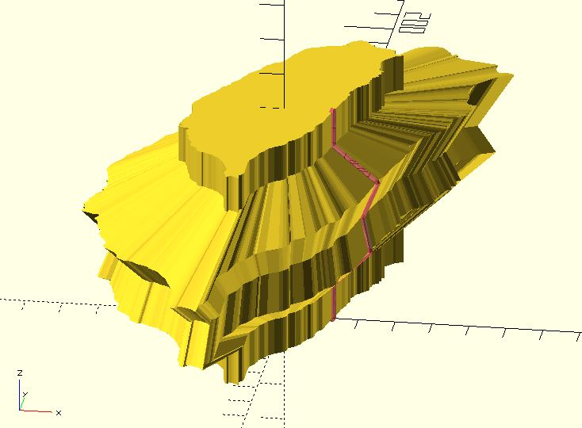
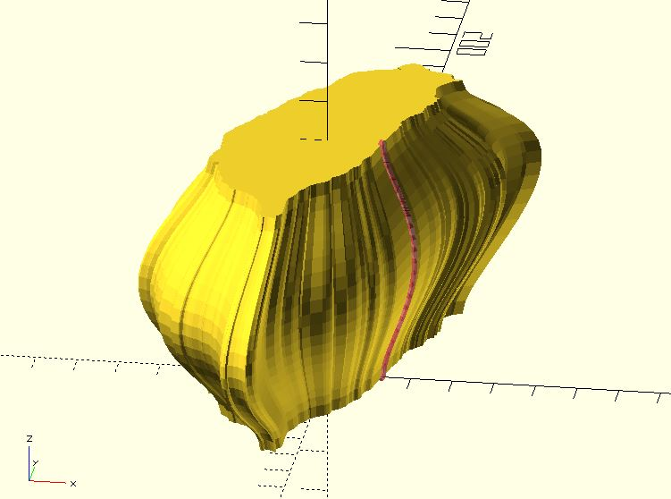
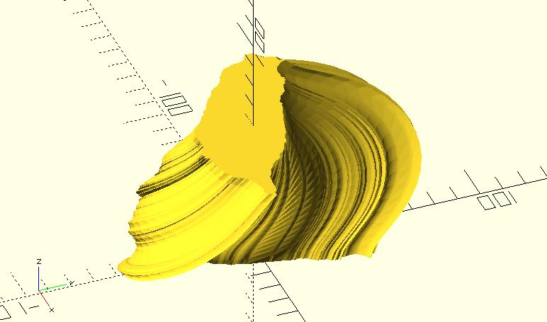

# path_scaling_sections

Given a edge path with the first point [x, 0, 0] or [0, y, 0] at the outline of a shape. This function use the path to calculate scaling factors and returns all scaled sections. Combined with the `polysections` module, you can create a extrusion with the path as an edge.

**Since:** 1.2.

## Parameters

- `shape_pts` : A list of points represent a shape.
- `edge_path` : A list of points represent the edge path.

## Examples

	include <hull_polyline3d.scad>;
	include <shape_taiwan.scad>;
	include <path_scaling_sections.scad>;
	include <m_scaling.scad>;
	include <polysections.scad>;

	taiwan = shape_taiwan(100);
	fst_pt = [13, 0, 0];

	edge_path = [
		fst_pt,
		fst_pt + [0, 0, 10],
		fst_pt + [10, 0, 20],
		fst_pt + [8, 0, 30],
		fst_pt + [12, 0, 40],
		fst_pt + [0, 0, 50],
		fst_pt + [0, 0, 60]
	];

	#hull_polyline3d(edge_path);
	polysections(path_scaling_sections(taiwan, edge_path));

	include <hull_polyline3d.scad>;
	include <shape_taiwan.scad>;
	include <path_scaling_sections.scad>;
	include <m_scaling.scad>;
	include <polysections.scad>;
	include <bezier_curve.scad>;

	taiwan = shape_taiwan(100);
	fst_pt = [13, 0, 0];

	edge_path = bezier_curve(0.05, [
		fst_pt,
		fst_pt + [0, 0, 10],
		fst_pt + [10, 0, 20],
		fst_pt + [8, 0, 30],
		fst_pt + [12, 0, 40],
		fst_pt + [0, 0, 50],
		fst_pt + [0, 0, 60]
	]);

	#hull_polyline3d(edge_path);
	polysections(path_scaling_sections(taiwan, edge_path));

	include <shape_taiwan.scad>;
	include <path_scaling_sections.scad>;
	include <m_scaling.scad>;
	include <polysections.scad>;
	include <bezier_curve.scad>;
	include <rotate_p.scad>;

	taiwan = shape_taiwan(100);
	fst_pt = [13, 0, 0];

	edge_path = bezier_curve(0.05, [
		fst_pt,
		fst_pt + [0, 0, 10],
		fst_pt + [10, 0, 20],
		fst_pt + [8, 0, 30],
		fst_pt + [12, 0, 40],
		fst_pt + [0, 0, 50],
		fst_pt + [0, 0, 60]
	]);

	leng = len(edge_path);
	twist = 90;
	twist_step = twist / leng;
	sections = path_scaling_sections(taiwan, edge_path);

	rotated_sections = [
		for(i = [0:leng - 1]) 
		[
			for(p = sections[i]) 
				rotate_p(p, twist_step * i)        
		]
	];

	polysections(rotated_sections);

	