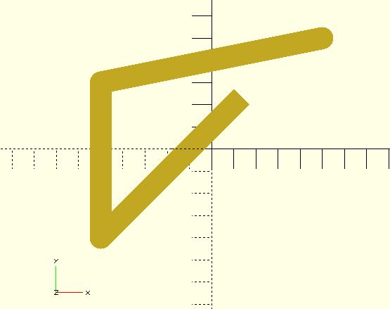

# polyline2d

Creates a polyline from a list of `x`, `y` coordinates. It depends on the `line2d` module so you have to `include` line2d.scad.

## Parameters

- `points` : The list of `x`, `y` points of the polyline. : A vector of 2 element vectors. The points are indexed from 0 to n-1.
- `width` : The line width.
- `startingStyle` : The end-cap style of the starting point. The value must be `CAP_BUTT`, `CAP_SQUARE` or `CAP_ROUND` (defined in line2d.scad). The default value is `CAP_SQUARE`. 
- endingStyle : The end-cap style of the ending point. The value must be `CAP_BUTT`, `CAP_SQUARE` or `CAP_ROUND` (defined in line2d.scad). The default value is `CAP_SQUARE`. 
- `round_fn` = When the end-cap style is `CAP_ROUND`, it controlls the `$fn` value used by the `circle` module. The default value is `24`.

## Examples

	polyline2d(points = [[1, 2], [-5, -4], [-5, 3], [5, 5]], width = 1);

    polyline2d(points = [[1, 2], [-5, -4], [-5, 3], [5, 5]], width = 1,
               endingStyle = CAP_ROUND);

	polyline2d(points = [[1, 2], [-5, -4], [-5, 3], [5, 5]], width = 1,
               startingStyle = CAP_ROUND, endingStyle = CAP_ROUND);

