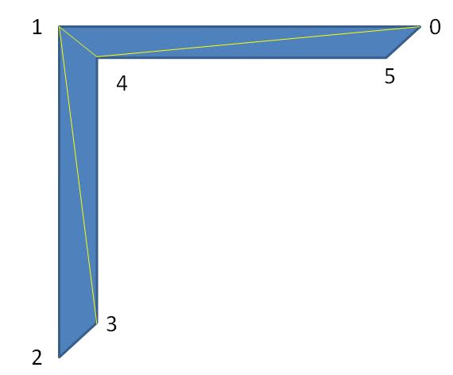

# polysections

Crosscutting a tube-like shape at different points gets several cross-sections. This module can operate reversely. It uses cross-sections to construct a tube-like shape. For example, imagine that you have the following cross-sections:

This module can use them to construct the following model:

Looks like extruding along the path? Yes, it can perform the task; however, it's more flexible. 

You can also view it as a better polyline3d module if you want. If you have only the points of a path, using `polyline3d` or `hull_polyline3d` is a simple solution. If you know the cross-sections along a path, you can use `polysections` to do more. 

When using this module, you should use points to represent each cross-section. The points of your 2D shape should have count-clockwise indexes. For example:

If your 2D shape is hollow, set the `triangles` parameter to `"HOLLOW"` and index the points as the following:

You can cut triangles by yourself. For example, the above shape can be cut into triangles such as:

The indexes of the above triangles is:

    [
        [0, 4, 3],
        [0, 1, 4],
        [1, 5, 4],
        [1, 2, 5],
        [2, 3, 5],
        [2, 0, 3]
    ]

In this module, triangles may be defined in any order. Of course, [following the preference of OpenSCAD](https://en.wikibooks.org/wiki/OpenSCAD_User_Manual/Primitive_Solids#polyhedron) is ok.

## Parameters

- `sections` : A list of cross-sections. Each cross-section is represented by a list of points. See the example below.
- `triangles` : `"SOLID"` (default), `"HOLLOW"`,  or user-defined indexes. See example below.

## Examples

	include <rotate_p.scad>;
	include <polysections.scad>;

	section1 = [
		[20, 0, 0],
		[18, 9, 0],
		[15, 10, 0],
		[10, 0, 0]
	];

	// spin section1
	sections = [
		for(i = [0:55]) 
			[
				for(p = section1)
					let(pt = rotate_p(p, [90, 0, 10 * i]))
					[pt[0], pt[1] , pt[2] + i]
			]
	];

	polysections(sections);

	include <rotate_p.scad>;
	include <polysections.scad>;
	
	section1 = [
	    // outer
		[20, 0, 0],
		[18, 9, 0],
		[15, 10, 0],
		[10, 0, 0],
	    // inner
        [18, 2, 0],
        [17, 7, 0],
        [15, 7, 0],
	    [12, 2, 0]
	];
	
	// spin section1
	sections = [
	    for(i = [0:55]) 
	        [
	            for(p = section1)
	                let(pt = rotate_p(p, [90, 0, 10 * i]))
	                [pt[0], pt[1] , pt[2] + i]
	        ]
	];
	    
	polysections(sections, "HOLLOW");

	include <rotate_p.scad>;
	include <polysections.scad>;
	
	section1 = [
	    // outer
        [30, 0, 0],
	    [15, 10, 0],
	    [10, 0, 0],
	    // inner
	    [26, 1, 0],
	    [15, 8, 0],
	    [12, 1, 0],        
	];
	
	// spin section1
	sections = [
	    for(i = [0:55]) 
	        [
	            for(p = section1)
	                let(pt = rotate_p(p, [90, 0, 10 * i]))
	                [pt[0], pt[1] , pt[2] + i]
	        ]
	];
	    
	polysections(
	   sections = sections, 
	   triangles = [
            [0, 3, 1],
            [1, 3, 4],
            [1, 4, 2],
            [2, 4, 5],
            [2, 5, 0],
            [0, 5, 3]
        ]
	);

