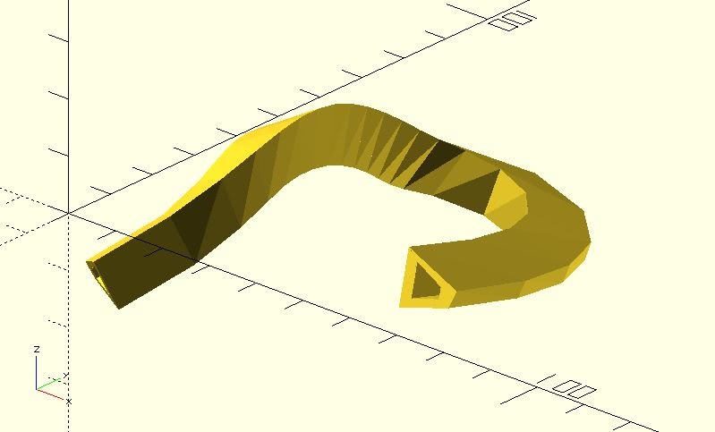
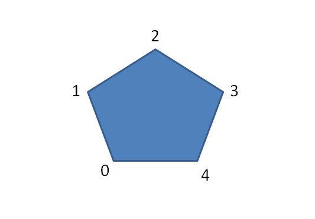
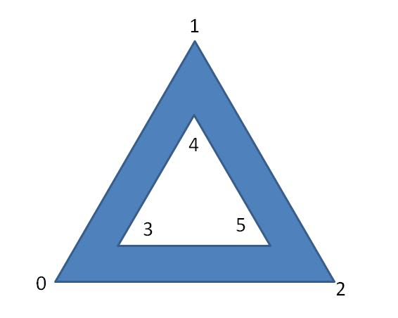
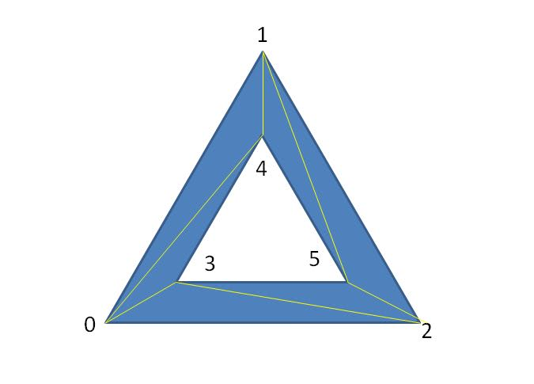
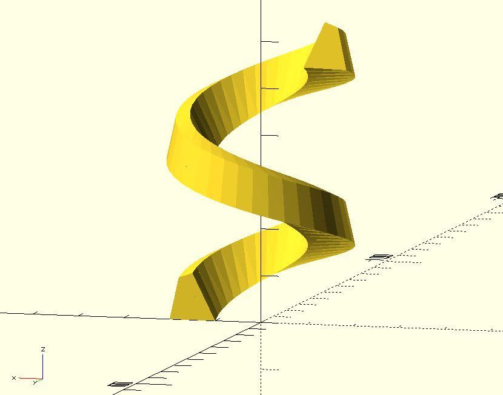
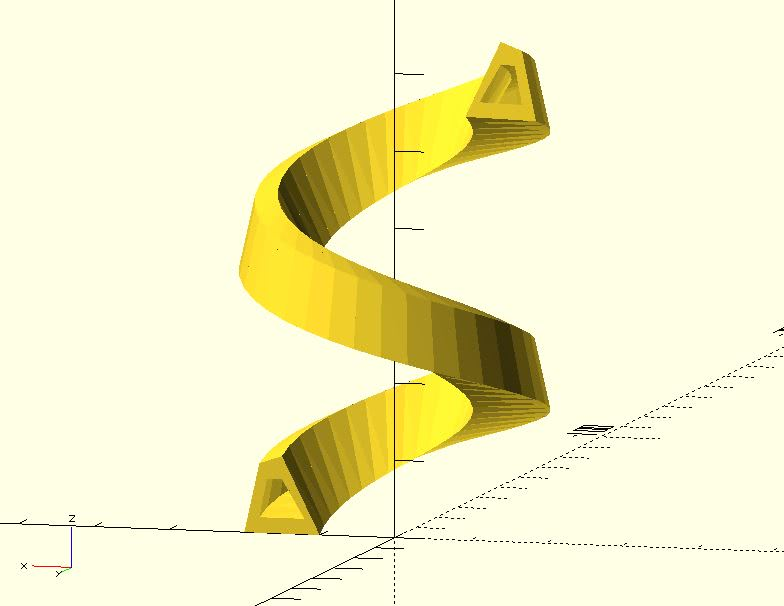
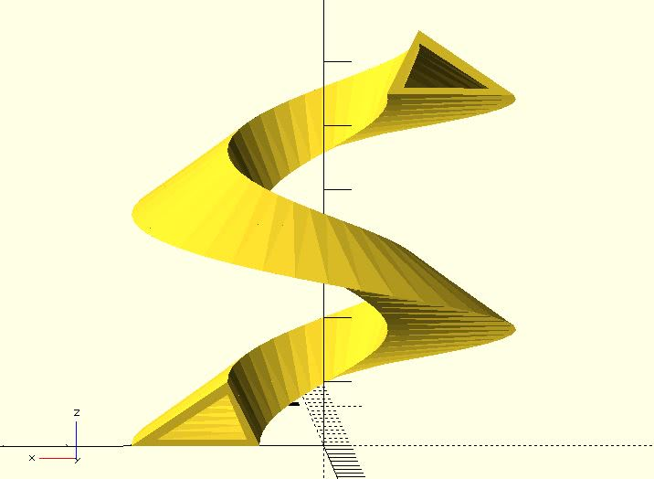

# polysections

Crosscutting a tube-like shape at different points gets several cross-sections. This module can operate reversely. It uses cross-sections to construct a tube-like shape. For example, imagine that you have the following cross-sections:

This module can use them to construct the following model:

Looks like extruding along the path? Yes, it can perform the task; however, it's more flexible. 

You can also view it as a better polyline3d module if you want. If you have only the points of a path, using `polyline3d` or `hull_polyline3d` is a simple solution. If you know the cross-sections along a path, you can use `polysections` to do more. 

When using this module, you should use points to represent each cross-section. You need to provide indexes of triangles, too. This module provides two prepared triangles indexes. One is `"RADIAL"`. For example, if you have a cross-section such as:

When using `"RADIAL"` (default), the module will cut them into triangles from the first point to each remaining point:

If your cross-sections are hollow, you may use `"HOLLOW"`. For example:

When using `"HOLLOW"`, the above shape will be cut into triangles such as:

You can cut triangles by yourself, for example, the indexes of the above triangles is:

    [
        [0, 3, 4],
        [0, 4, 1],
        [1, 4, 5],
        [1, 5, 2],
        [2, 5, 3],
        [2, 3, 0]
    ]

Triangles may be defined in any order.

## Parameters

- `sections` : A list of cross-sections. Each cross-section is represented by a list of points. See the example below.
- `triangles` : `"RADIAL"` (default), `"HOLLOW"` or user-defined indexes. See example below.

## Examples

	include <rotate_p.scad>;
	include <polysections.scad>;
	
	section1 = [
	    [10, 0, 0],
	    [15, 10, 0],
	    [18, 9, 0],
	    [20, 0, 0]
	];
	
	// spin section1
	sections = [
	    for(i = [0:55]) 
	        [
	            for(p = section1)
	                let(pt = rotate_p(p, [90, 0, -10 * i]))
	                [pt[0], pt[1] , pt[2] + i]
	        ]
	];
	    
	polysections(sections);

	include <rotate_p.scad>;
	include <polysections.scad>;
	
	section1 = [
	    // outer
	    [10, 0, 0],
	    [15, 10, 0],
	    [18, 9, 0],
	    [20, 0, 0],
	    // inner
	    [12, 2, 0],
	    [15, 7, 0],
	    [17, 7, 0],
	    [18, 2, 0]
	];
	
	// spin section1
	sections = [
	    for(i = [0:55]) 
	        [
	            for(p = section1)
	                let(pt = rotate_p(p, [90, 0, -10 * i]))
	                [pt[0], pt[1] , pt[2] + i]
	        ]
	];
	    
	polysections(sections, "HOLLOW");

	include <rotate_p.scad>;
	include <polysections.scad>;
	
	section1 = [
	    // outer
	    [10, 0, 0],
	    [15, 10, 0],
	    [30, 0, 0],
	    // inner
	    [12, 1, 0],
	    [15, 8, 0],
	    [26, 1, 0],        
	];
	
	// spin section1
	sections = [
	    for(i = [0:55]) 
	        [
	            for(p = section1)
	                let(pt = rotate_p(p, [90, 0, -10 * i]))
	                [pt[0], pt[1] , pt[2] + i]
	        ]
	];
	    
	polysections(
	   sections = sections, 
	   triangles = [
	        [0, 3, 4],
	        [0, 4, 1],
	        [1, 4, 5],
	        [1, 5, 2],
	        [2, 5, 3],
	        [2, 3, 0]
	    ]
	);

