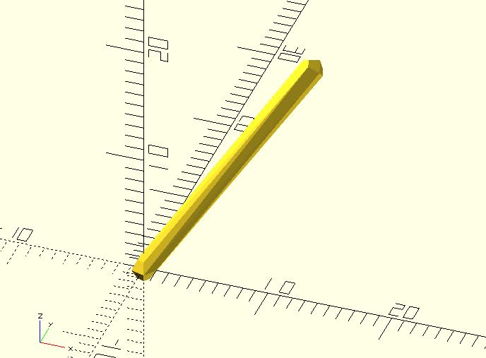
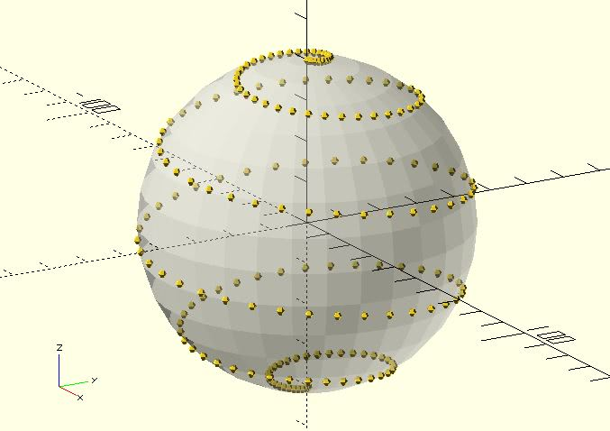

# rotate_p

Rotates a point `a` degrees around an arbitrary axis. It behaves as the built-in `rotate` module

## Parameters

- `point` : A 3D point `[x, y, z]` or a 2D point `[x, y]`.
- `a` : If it's `[deg_x, deg_y, deg_z]`, the rotation is applied in the order `x`, `y`, `z`. If it's `[deg_x, deg_y]`, the rotation is applied in the order `x`, `y`.  If it's`[deg_x]`, the rotation is only applied to the `x` axis. If it's an number, the rotation is only applied to the `z` axis.

## Examples
    
You can use the code below to create a line.

    include <rotate_p.scad>;

	hull() {
	    sphere(1);
	    rotate([0, -45, 45]) 
	        translate([20, 0, 0]) 
	            sphere(1);   
	}  

The following code has the same effect.

    include <rotate_p.scad>;

	point = [20, 0, 0];
	a = [0, -45, 45];
	
	hull() {
	    sphere(1);
	    translate(rotate_p(point, a))    
	       rotate(a)  
	           sphere(1);   
	}  

The `rotate_p` function is useful in some situations. For example, you probably want to get all points on the path of a spiral around a sphere. 

    include <rotate_p.scad>;

	radius = 40;
	step_angle = 10;
	z_circles = 20;
	
	points = [for(a = [0:step_angle:90 * z_circles]) 
	    rotate_p(
	        [radius, 0, 0], 
	        [0, -90 + 2 * a / z_circles, a]
	    )
	];
	
	// Once you get all points on the path, you can place anything at each point.
	// I just place a sphere as a simple demonstration.
	for(p = points) {
	    translate(p) 
	        sphere(1);
	}
	
	%sphere(radius);

