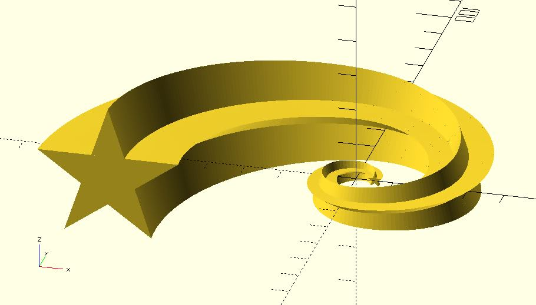

# shape_pentagram

Returns shape points of a pentagram. They can be used with xxx_extrude modules of dotSCAD. The shape points can be also used with the built-in polygon module. 

## Parameters

- `r` : The length between the center and a tip.

## Examples

	include <shape_pentagram.scad>;

	polygon(shape_pentagram(5));

	include <shape_pentagram.scad>;
	include <circle_path.scad>;
	include <rotate_p.scad>;
	include <golden_spiral.scad>;
	include <cross_sections.scad>;
	include <polysections.scad>;
	include <golden_spiral_extrude.scad>;

	shape_pts = shape_pentagram(2);

	golden_spiral_extrude(
		shape_pts, 
		from = 5, 
		to = 10, 
		point_distance = 1,
		scale = 10
	);

