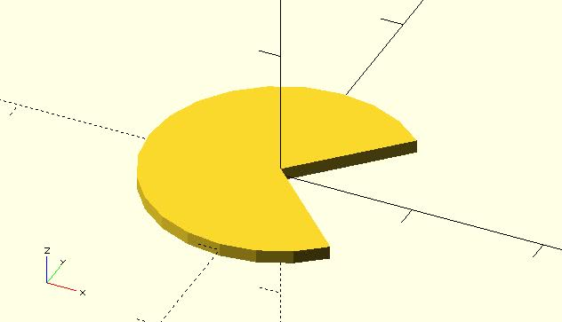
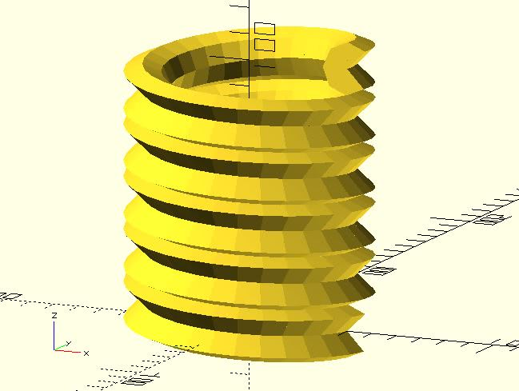

# shape_pie

Returns shape points and triangle indexes of a pie (circular sector) shape. They can be used with xxx_extrude modules of dotSCAD. The shape points can be also used with the built-in polygon module. 

## Parameters

- `radius` : The radius of the circle.
- `angles` : A 2 element vector which defines the central angle. The first element of the vector is the beginning angle in degrees, and the second element is the ending angle.
- `$fa`, `$fs`, `$fn` : Check [the circle module](https://en.wikibooks.org/wiki/OpenSCAD_User_Manual/Using_the_2D_Subsystem#circle) for more details.

## Examples

	include <shape_pie.scad>;
	
	shape_pts_tris = shape_pie(10, [45, 315], $fn = 24);

    include <shape_pie.scad>;
    include <helix.scad>;
    include <rotate_p.scad>;
    include <cross_sections.scad>;
    include <polysections.scad>;
    include <helix_extrude.scad>;

    shape_pts_tris = shape_pie(10, [45, 315], $fn = 8);

    helix_extrude(shape_pts_tris[0], 
        radius = 40, 
        levels = 5, 
        level_dist = 20,
        triangles = shape_pts_tris[1]
    );

