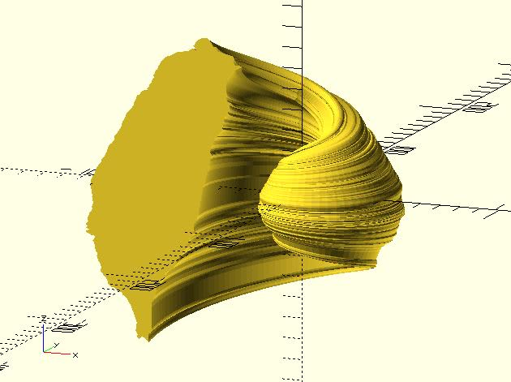

# shape_taiwan

Returns shape points of [Taiwan](https://www.google.com.tw/maps?q=taiwan&um=1&ie=UTF-8&sa=X&ved=0ahUKEwjai9XrqurTAhVIopQKHbEHClwQ_AUICygC). They can be used with xxx_extrude modules of dotSCAD. The shape points can be also used with the built-in polygon module. 

## Parameters

- `h` : The height of Taiwan.

## Examples

	include <shape_taiwan.scad>;

	polygon(shape_taiwan(10));

	include <shape_taiwan.scad>;
	include <circle_path.scad>;
	include <rotate_p.scad>;
	include <golden_spiral.scad>;
	include <cross_sections.scad>;
	include <polysections.scad>;
	include <golden_spiral_extrude.scad>;

	mirror_taiwan = [for(pt = shape_taiwan(15)) [pt[0] * -1, pt[1]]];

	golden_spiral_extrude(
		mirror_taiwan, 
		from = 1,  
		to = 10, 
		point_distance = 2.5,
		scale = 10
	);

