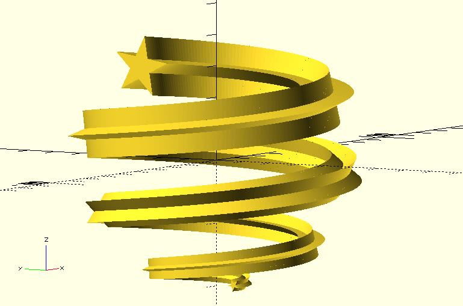

# sphere_spiral_extrude

Extrudes a 2D shape along the path of a sphere spiral. 

When using this module, you should use points to represent the 2D shape. You need to provide indexes of triangles, too. This module provides two prepared triangles indexes. One is `"RADIAL"`. See [polysections](https://openhome.cc/eGossip/OpenSCAD/lib-polysections.html) for details.

Dependencies: `rotate_p`, `sphere_spiral`, `cross_sections`, `polysections`.

## Parameters

- `shape_pts` : A list of points represent a shape. See the example below.
- `radius` , `za_step`, `z_circles`, `begin_angle`, `end_angle`, `vt_dir`, `rt_dir` : See [sphere_spiral](https://openhome.cc/eGossip/OpenSCAD/lib-sphere_spiral.html) for details.
- `twist` : The number of degrees of through which the shape is extruded.
- `scale` : Scales the 2D shape by this value over the length of the extrusion. Scale can be a scalar or a vector.
- `triangles` : `"RADIAL"` (default), `"HOLLOW"` or user-defined indexes. See [polysections](https://openhome.cc/eGossip/OpenSCAD/lib-polysections.html) for details.

## Examples
    
	include <rotate_p.scad>;
	include <cross_sections.scad>;
	include <polysections.scad>;
	include <sphere_spiral.scad>;
	include <sphere_spiral_extrude.scad>;

	function shape_pentagram(r) =
		[
			// shape points
			[
				[0, 1], [-0.224514, 0.309017], 
				[-0.951057, 0.309017], [-0.363271, -0.118034], 
				[-0.587785, -0.809017], [0, -0.381966], 
				[0.587785, -0.809017], [0.363271, -0.118034], 
				[0.951057, 0.309017], [0.224514, 0.309017]
			] * r,
			// triangles
			[   
				[0, 1, 9],
				[2, 3, 1],
				[4, 5, 3],
				[6, 7, 5],
				[8, 9, 7],
				[1, 3, 5],
				[1, 5, 7],
				[1, 7, 9]
			]
		];

	points_triangles = shape_pentagram(2);

	sphere_spiral_extrude(
		shape_pts = points_triangles[0],
		radius = 40, 
		za_step = 2, 
		z_circles = 20, 
		begin_angle = 90, 
		end_angle = 450,
		vt_dir = "SPI_UP",
		scale = 5,
		triangles = points_triangles[1]
	);

