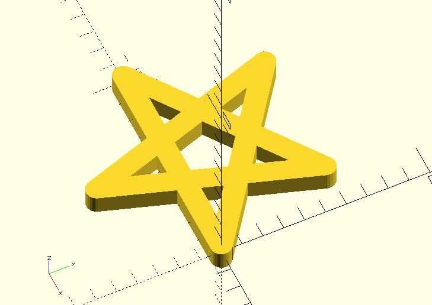
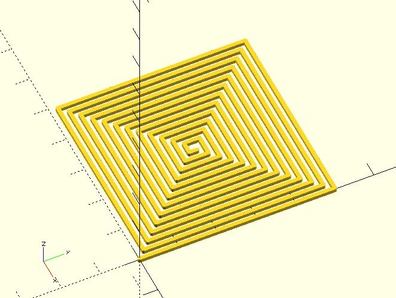

# turtle2d

An OpenSCAD implementation of Turtle Graphics. It moves on the xy plane. You can get the cooridinate `[x, y]` or `angle` of its current position.

## Parameters

- `cmd` : A string command. Different commands use different numbers of arguments. 
    - `"create"` : Creates a turtle data. The command needs three arguments `x`, `y` and `angle`. For example, use `turtle2d("create", 5, 10, 30)` to create a turtle located at `[0, 0]` with an angle `30` degrees.
    - `"x"` : Sets or gets the `x` coordinate of a turtle. If you provide a turtle data and the `x` coordinate, such as `turtle2d("x", turtle, 20)`, it will sets the `x` coordinate. Giving a turtle data only will return the `x` coordinate.
    - `"y"` : Sets or gets the `y` coordinate of a turtle. If you provide a turtle data and   the `y` coordinate, such as `turtle2d("y", turtle, 20)`, it will sets the `y` coordinate. Giving a turtle data only will return the `y` coordinate.
    - `"angle"` : Sets or gets the angle of a turtle. If you provide a turtle data and the angle, such as `turtle2d("angle", turtle, 45)`, it will sets the angle. Giving a turtle data only will return the angle.
    - `"pt"` : Sets or Gets `[x, y]` of a turtle. If you provide a turtle data and the coordinates, such as `turtle2d("pt", turtle, [10, 20])`, it will sets the coordinates. Giving a turtle data only will return the coordinates.
    - `"forward"` : Forwards a turtle. The command needs two arguments. The first one is a turtle data, and the second one is the length. For example, `turtle2d("forward", turtle, 100)`.
    - `"forward"` : Turns a turtle. The command needs two arguments. The first one is a turtle data, and the second one is the angle. For example, `turtle2d("turn", turtle, 180)`.

## Examples
	    
	include <line2d.scad>;
	include <turtle2d.scad>;
	
	module turtle_spiral(t_before, times, side_leng, angle, width) {
	    $fn = 24;
	    if(times != 0) {
	        t_after_tr = turtle2d("turn", t_before, angle);
	        t_after_fd = turtle2d("forward", t_after_tr, side_leng);
	
	        line2d(
	            turtle2d("pt", t_before),
	            turtle2d("pt", t_after_fd),
	            width,
	            p1Style = "CAP_ROUND", 
	            p2Style =  "CAP_ROUND"
	        );
	
	        turtle_spiral(t_after_fd, times - 1, side_leng, angle, width);
	    }
	
	}
	
	side_leng = 10;
	angle = 144;
	width = 1;
	times = 5;
	
	turtle_spiral(turtle2d("create", 0, 0, 0), times, side_leng, angle, width);

	
	include <line2d.scad>;
    include <turtle2d.scad>;

	module turtle_spiral(t_before, side_leng, d_step, min_leng, angle, width) {
	    $fn = 24;
	    if(side_leng > min_leng) {
	        t_after = turtle2d("forward", turtle2d("turn", t_before, angle), side_leng);
	
	        line2d(
	            turtle2d("pt", t_before),
	            turtle2d("pt", t_after),
	            width,
	            p1Style = "CAP_ROUND", 
	            p2Style =  "CAP_ROUND"
	        );
	        
	        
	        turtle_spiral(t_after, side_leng - d_step, d_step, min_leng, angle, width);
	    }
	
	}
	
	side_leng = 50;
	d_step = 1;
	min_leng = 1;
	angle = 90;
	width = 1;
	
	turtle_spiral(
	    turtle2d("create", 0, 0, 0), 
	    side_leng, 
	    d_step, 
	    min_leng, 
	    angle, 
	    width
	);

