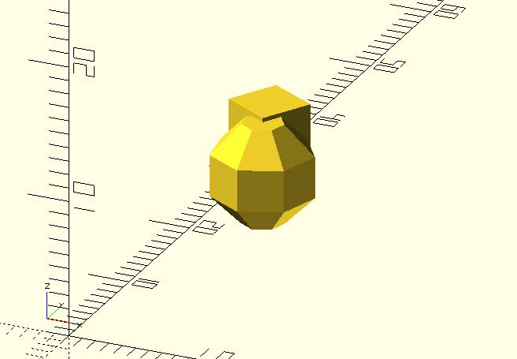

# m_cumulate

The power of using transformation matrice is that you can cumulate all transformations in a matrix. This function multipies all transformation matrice. 

**Since:** 1.1

## Parameters

The dir changed since 2.0. 

- `matrice` : A list of 4x4 transformation matrice.

## Examples

	include <matrix/m_rotation.scad>;
	include <matrix/m_scaling.scad>;
	include <matrix/m_translation.scad>;
	include <matrix/m_cumulate.scad>

	m = m_cumulate([
		m_translation([10, 20, 10]), m_scaling(2), m_rotation(60)]
	);

	multmatrix(m) 
		cube(1);
		
	multmatrix(m)    
		sphere(1);

