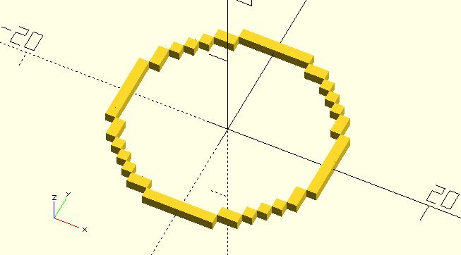
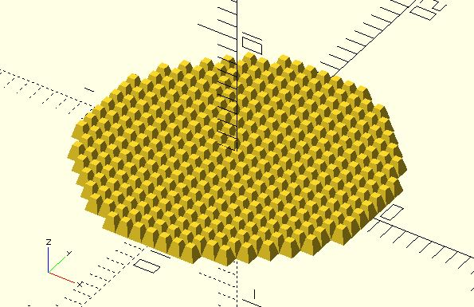

# px_circle

Returns points that can be used to draw a pixel-style circle.

**Since:** 2.0

## Parameters

- `radius` : The circle radius. The value must be an integer.
- `filled` : Default to `false`. Set it `true` if you want a filled circle.

## Examples

	include <pixel/px_circle.scad>;

	for(pt = px_circle(10)) {
		translate(pt)
			square(1, center = true);
	}

	include <pixel/px_circle.scad>;

	for(pt = px_circle(10, filled = true)) {
		translate(pt)
			linear_extrude(1, scale = 0.5) 
				square(1, center = true);
	}
		

