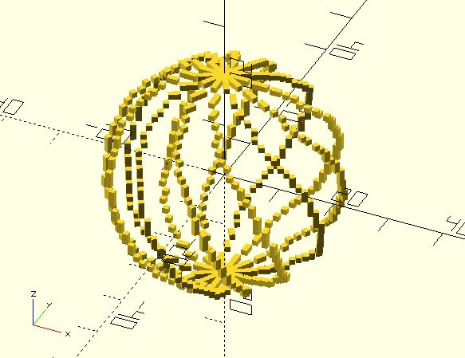

# px_polyline

Given a list of points. `px_line` returns points that can be used to draw a pixel-style polyline.

**Since:** 2.0

## Parameters

- `points` : A list of points. Each point can be `[x, y]` or `[x, y, z]`. x, y, z must be integer.

## Examples

	include <pixel/px_line.scad>;
	include <pixel/px_polyline.scad>;
	include <shape_pentagram.scad>;

	pentagram = [
		for(pt = shape_pentagram(15)) 
			[round(pt[0]), round(pt[1])]
	];

	for(pt = px_polyline(concat(pentagram, [pentagram[0]]))) {
		translate(pt) 
			linear_extrude(1, scale = 0.5) 
			    square(1, center = true);
	}

	include <pixel/px_line.scad>;
	include <pixel/px_polyline.scad>;
	include <rotate_p.scad>;
	include <sphere_spiral.scad>;

	points_angles = sphere_spiral(
		radius = 20, 
		za_step = 5
	);

	points = [
		for(pa = points_angles) 
		let(pt = pa[0])
		[round(pt[0]), round(pt[1]), round(pt[2])]
	];

	for(a = [0:30:330]) { 
		rotate(a) 
			for(pt = px_polyline(points)) {
				translate(pt)
					cube(1, center = true);
			}
	}
		

