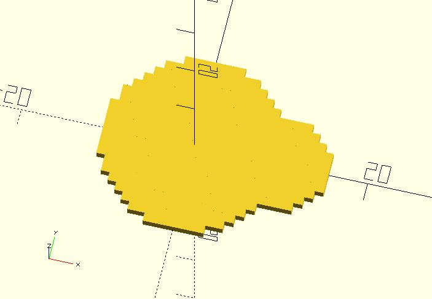
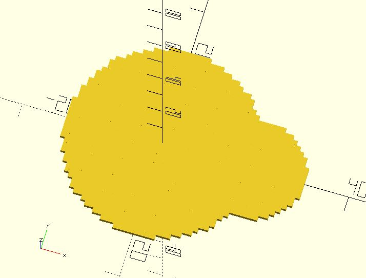

# dedup

Eliminating duplicate copies of repeating vectors. If `lt` has many elements, sorting `lt` first and setting `sorted` to `true` will be faster.

**Since:** 2.3

## Parameters

- `lt` : A list of vectors.
- `sorted` : If `false` (default), use native `search`. If `true`, `lt` must be sorted by zyx (from the last index to the first one) and `dedup` will use binary search internally.

## Examples

    use <pixel/px_circle.scad>;
    use <util/dedup.scad>;

    pts1 = px_circle(10, filled = true);
    pts2 = [for(p = px_circle(5, filled = true)) p + [10, 0]];

    // simple union
    pts3 = dedup(concat(pts1, pts2));
    for(p = pts3) {
        translate(p)
            square(1, center = true);
    }

    use <pixel/px_circle.scad>;
    use <util/sort.scad>;
    use <util/dedup.scad>;

    pts1 = px_circle(20, filled = true);
    pts2 = [for(p = px_circle(10, filled = true)) p + [20, 0]];

    sorted_pts = sort(concat(pts1, pts2), by = "vt");
    
    // simple union
    pts3 = dedup(sorted_pts, sorted = true);
    for(p = pts3) {
        translate(p)
            square(1, center = true);
    }

