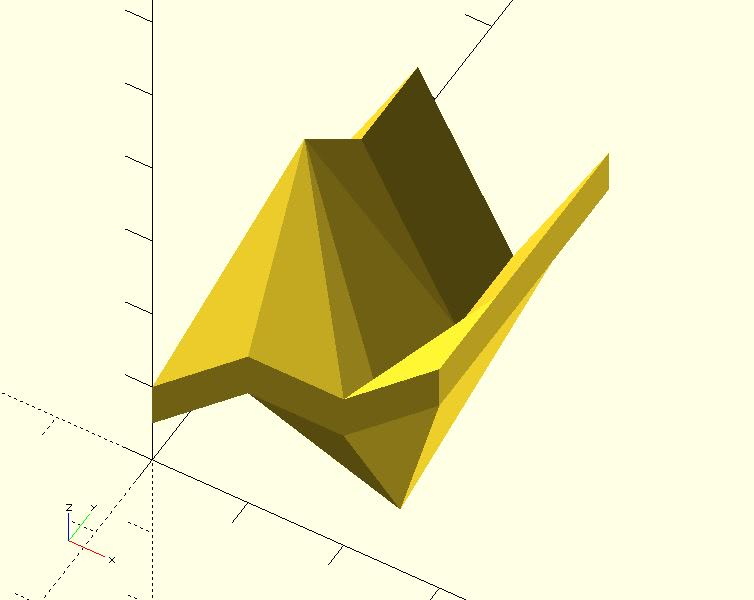
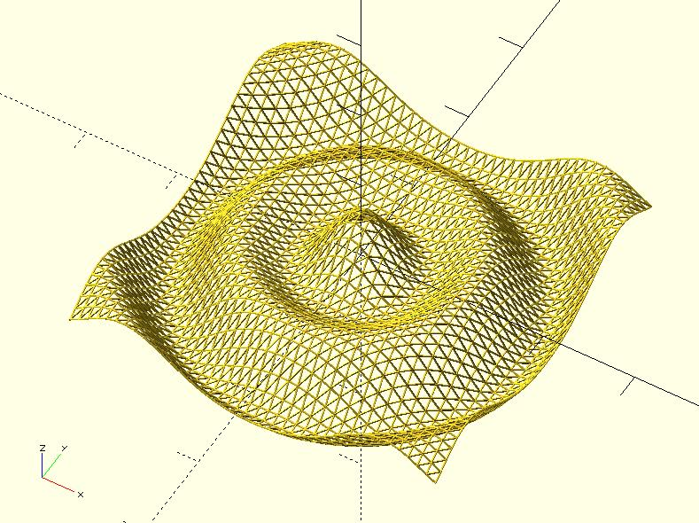
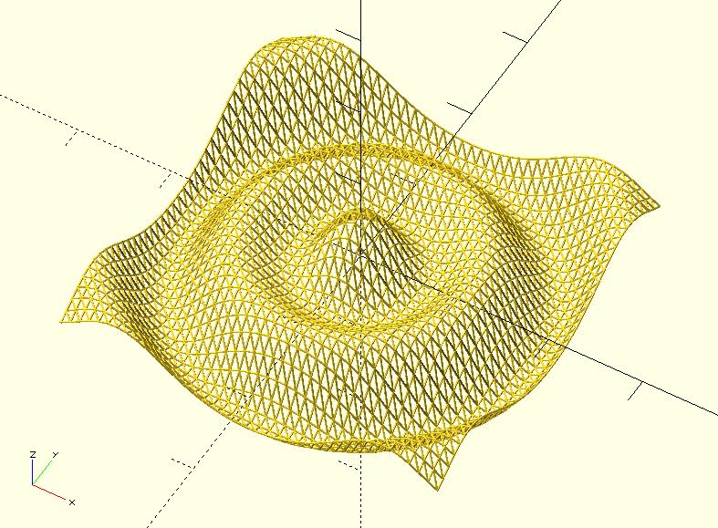

# function_grapher

Given a set of points `[x, y, f(x, y)]` where `f(x, y)` is a mathematics function, the `function_grapher` module can create the graph of `f(x, y)`.

## Parameters

- `points` : A set of points `[x, y, f(x, y)]`. See examples below.
- `thickness` : The face or line thickness.
- `style` : The style of the graph. It accepts `"FACES"`, `"LINES"`, `"HULL_FACES"` and `"HULL_LINES"`. The default value is `"FACES"` which simply takes `f(x, y) - thickness` for each point to build a bottom. It may cause thickness problems when slopes is high. The `"HULL_FACES"` value can solve the problem but is slow. When assigning `"LINES"`, it uses lines to connect points. The `"HULL_LINES"` is very very slow; however, the model might look smoother if you have a small `$fn`.
- `slicing` : Given a rectangle, we have two ways to slice it into two triangles. Using this parameter to determine the way you want. It accepts `"SLASH"` (default) and `"BACK_SLASH"`.
- `$fa`, `$fs`, `$fn` : Used by the `circle` or `sphere` module internally. It affects the speed of rending. For example, a large `$fn` may be very slow when rending. Check [the circle module](https://en.wikibooks.org/wiki/OpenSCAD_User_Manual/Using_the_2D_Subsystem#circle) or [the sphere module](https://en.wikibooks.org/wiki/OpenSCAD_User_Manual/Primitive_Solids#sphere) for more details. 

## Examples

	use <function_grapher.scad>;
	
	points = [
	    [[0, 0, 1], [1, 0, 2], [2, 0, 2], [3, 0, 3]],
	    [[0, 1, 1], [1, 1, 4], [2, 1, 0], [3, 1, 3]],
	    [[0, 2, 1], [1, 2, 3], [2, 2, 1], [3, 2, 3]],
	    [[0, 3, 1], [1, 3, 3], [2, 3, 1], [3, 3, 3]]
	];
	
	thickness = 0.5;
	
	function_grapher(points, thickness);

	use <function_grapher.scad>;
	
	function f(x, y) = 
	   30 * (
	       cos(sqrt(pow(x, 2) + pow(y, 2))) + 
	       cos(3 * sqrt(pow(x, 2) + pow(y, 2)))
	   );
	
	thickness = 2;
	min_value =  -200;
	max_value = 200;
	resolution = 10;
	
	points = [
	    for(y = [min_value:resolution:max_value])
	        [
	            for(x = [min_value:resolution:max_value]) 
	                [x, y, f(x, y)]
	        ]
	];
	
	function_grapher(points, thickness);

	use <function_grapher.scad>;

	function f(x, y) = 
	   30 * (
	       cos(sqrt(pow(x, 2) + pow(y, 2))) + 
	       cos(3 * sqrt(pow(x, 2) + pow(y, 2)))
	   );
	
	thickness = 2;
	min_value =  -200;
	max_value = 200;
	resolution = 10;
	style = "LINES"; 
	
	points = [
	    for(y = [min_value:resolution:max_value])
	        [
	            for(x = [min_value:resolution:max_value]) 
	                [x, y, f(x, y)]
	        ]
	];
	
	function_grapher(points, thickness, style);

	use <function_grapher.scad>;

	function f(x, y) = 
	   30 * (
	       cos(sqrt(pow(x, 2) + pow(y, 2))) + 
	       cos(3 * sqrt(pow(x, 2) + pow(y, 2)))
	   );
	
	thickness = 2;
	min_value =  -200;
	max_value = 200;
	resolution = 10;
	style = "LINES"; 
	slicing = "BACK_SLASH";
	
	points = [
	    for(y = [min_value:resolution:max_value])
	        [
	            for(x = [min_value:resolution:max_value]) 
	                [x, y, f(x, y)]
	        ]
	];
	
	function_grapher(points, thickness, style, slicing);

