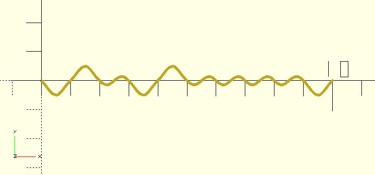

# nz_perlin1

Returns the 1D [Perlin noise](https://en.wikipedia.org/wiki/Perlin_noise) value at the x coordinate.

**Since:** 2.3

## Parameters

- `x` : The x coordinate.
- `seed` : The random seed.

## Examples

    use <hull_polyline2d.scad>;
    use <util/rand.scad>;
    use <noise/nz_perlin1.scad>;

    seed = rand();
    hull_polyline2d(
        [for(x = [0:.1:10]) [x, nz_perlin1(x, seed)]], width = .1
    );

