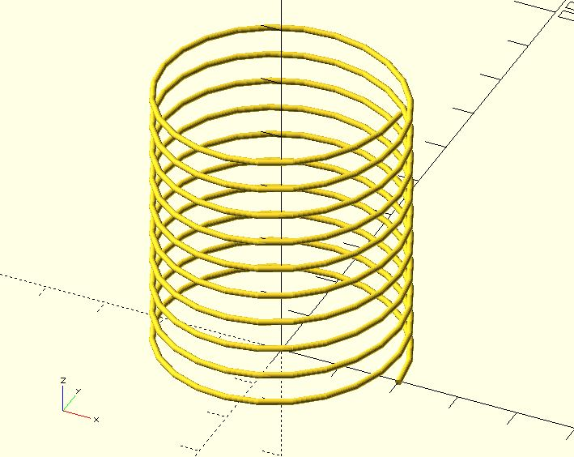

# polyline3d

Creates a polyline from a list of `[x, y, z]` coordinates. 

## Parameters

- `points` : The list of `[x, y, z]` points of the polyline. The points are indexed from 0 to n-1.
- `thickness` : The line thickness.
- `startingStyle` : The end-cap style of the starting point. The value must be `"CAP_BUTT"`, `"CAP_CIRCLE"` or `"CAP_SPHERE"`. The default value is `"CAP_CIRCLE"`. 
- `endingStyle` : The end-cap style of the ending point. The value must be `"CAP_BUTT"`, `"CAP_CIRCLE"` or `"CAP_SPHERE"`. The default value is `"CAP_CIRCLE"`.
- `$fa`, `$fs`, `$fn` : Used by the `circle` or `sphere` module internally. Check [the circle module](https://en.wikibooks.org/wiki/OpenSCAD_User_Manual/Using_the_2D_Subsystem#circle) or [the sphere module](https://en.wikibooks.org/wiki/OpenSCAD_User_Manual/Primitive_Solids#sphere) for more details. The final fragments of a circle will be a multiple of 4 to fit edges if possible.

## Examples

    use <polyline3d.scad>;

	polyline3d(
	    points = [
	        [1, 2, 1], 
	        [-5, -4, 2], 
	        [-5, 3, 3], 
	        [5, 5, 4]
	    ], 
	    thickness = 1,
        $fn = 24
	);

    use <polyline3d.scad>;

	polyline3d(
	    points = [
	        [1, 2, 1], 
	        [-5, -4, 2], 
	        [-5, 3, 3], 
	        [5, 5, 4]
	    ], 
	    thickness = 1,
	    endingStyle = "CAP_SPHERE",
        $fn = 24
	);

    use <polyline3d.scad>;

	polyline3d(
	    points = [
	        [1, 2, 1], 
	        [-5, -4, 2], 
	        [-5, 3, 3], 
	        [5, 5, 4]
	    ], 
	    thickness = 1,
	    startingStyle = "CAP_SPHERE",
	    endingStyle = "CAP_SPHERE",
        $fn = 24
	);

    use <polyline3d.scad>;
    
	r = 20;
	h = 5;
	fa = 15;
	circles = 10;
	
	points = [
	    for(a = [0:fa:360 * circles]) 
	        [r * cos(a), r * sin(a), h / (360 / fa) * (a / fa)]
	];
	polyline3d(points, thickness = 1, $fn = 24);

