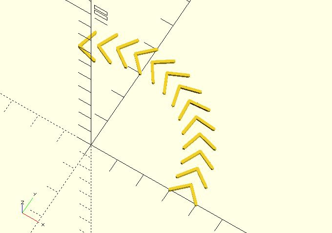
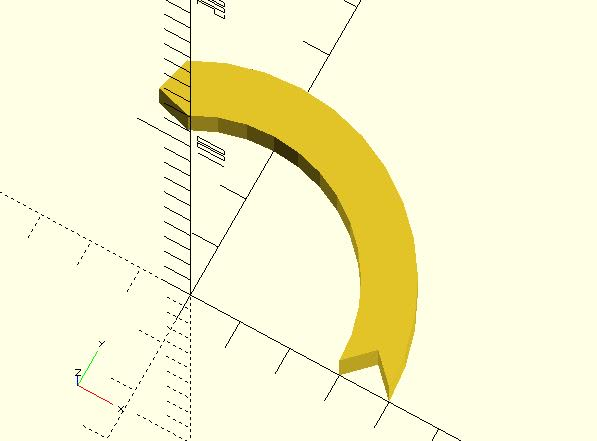

# polytransversals

Crosscutting a polyline at different points gets several transversals. This module can operate reversely. It uses transversals to construct a polyline. For example, imagine that you have the following transversals:

This module can use them to construct the polyline:

When using this module, you should use points to represent each transversal. 

You can view it as a better polyline2d module. If you have only the points of a path, using `polyline2d` or `hull_polyline2d` is a simple solution. If you know the transversals along a path, you can use `polytransversals` to get a better polyline.

## Parameters

- `transversals` : A list of transversals. Each transversal is represented by a list of points. See the example below.

## Examples

	use <rotate_p.scad>;
	use <polytransversals.scad>;
	use <hull_polyline2d.scad>;
	
	r = 35;    
	tran_pts = [[-5, 0], [0, 5], [5, 0]];
	
	trans = [
	    for(a = [0:10:120])
	        [
	            for(p = tran_pts) 
	                rotate_p(p, [0, 0, a]) + [r * cos(a), r * sin(a)]
	        ]
	];
	
	polytransversals(trans);
	
	#for(tran = trans) {
	    hull_polyline2d(tran, 0.5);
	}

