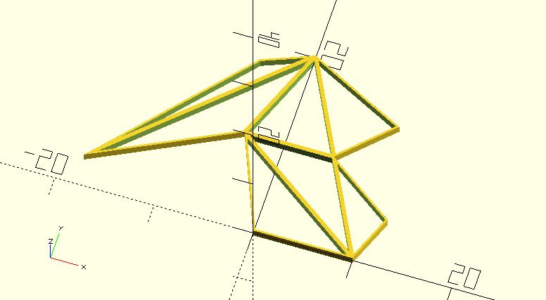

# triangulate

Given a 2D shape. This function performs a simple polygon triangulation algorithm and returns the indices of each triangle. 

**Since:** 1.3.

## Parameters

- `shape_pts` : The shape points.
- `epsilon` : An upper bound on the relative error due to rounding in floating point arithmetic. Default to 0.0001.

## Examples

    use <triangulate.scad>; 

    shape = [
        [0, 0],
        [10, 0],
        [12, 5],
        [5, 10],
        [10, 15],
        [0, 20],
        [-5, 18],
        [-18, 3],
        [-4, 10]
    ];

    tris = triangulate(shape);

    difference() {
        polygon(shape);

        for(tri = tris) {
            offset(-.2) 
                polygon([for(idx = tri) shape[idx]]);
            
        }
    }

