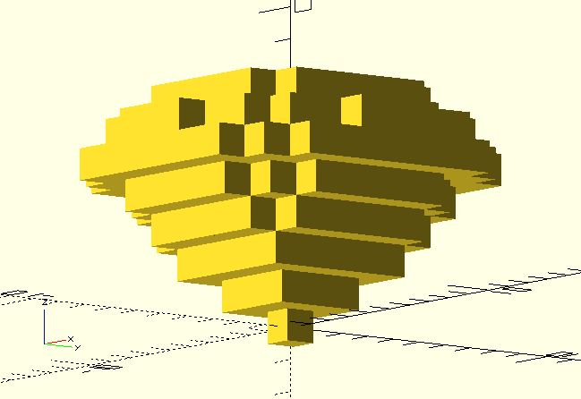

# vx_intersection

Creates an intersection of two lists of points. 

**Since:** 2.4

## Parameters

- `points1` : A list of points.
- `points2` : A list of points.

## Examples

	use <voxel/vx_cylinder.scad>;
	use <voxel/vx_sphere.scad>;
	use <voxel/vx_intersection.scad>;

	voxels = vx_intersection(
		vx_cylinder([1, 8], 8, filled = true),
		vx_sphere(8, filled = true)
	);

	for(pt = voxels) {
		translate(pt)
			cube(1, center = true);
	}

