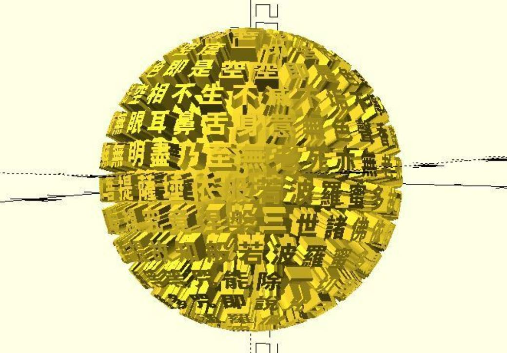

# bauer_spiral

Creates visually even spacing of n points on the surface of the sphere. Successive points will all be approximately the same distance apart. 

(It's called "visually even spacing" because only the vertices of the 5 [Platonic solids](https://en.wikipedia.org/wiki/Platonic_solid) can be said to be truly evenly spaced around the surface of a sphere.)

**Since:** 2.5

## Parameters

- `n` : The number of points.
- `radius` : The sphere radius. Default to 1.
- `rt_dir` : `"CT_CLK"` for counterclockwise. `"CLK"` for clockwise. The default value is `"CT_CLK"`.

## Examples

    use <bauer_spiral.scad>
    use <polyline_join.scad>

    n = 200;
    radius = 20;
    pts = bauer_spiral(n, radius);

    for(p = pts) {
        translate(p)
            sphere(1, $fn = 24);
    }

    polyline_join(pts) 
        sphere(.5);

You can use it to create [Text sphere](https://cults3d.com/en/3d-model/art/bauer-text-sphere).

