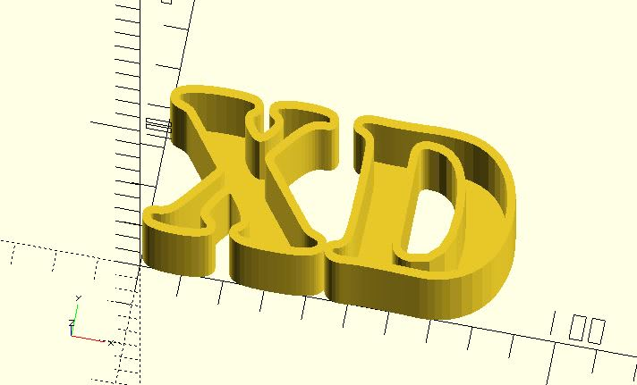

# box_extrude

Creates a box (container) from a 2D object.

## Parameters

- `height` : The box height.
- `shell_thickness` : The thickness between the exterior and interior.
- `offset_mode` : `"delta"` (default) or `"r"`. See [offset](https://en.wikibooks.org/wiki/OpenSCAD_User_Manual/Transformations#offset) for details.
- `chamfer` : Default `false`. See [offset](https://en.wikibooks.org/wiki/OpenSCAD_User_Manual/Transformations#offset) for details.
- `twist`, `slices`, `scale`: The same as `linear_extrude`. **Since:** 2.1.

## Examples

    use <box_extrude.scad>
    
	box_extrude(height = 30, shell_thickness = 2) 
	    circle(r = 30);

    use <box_extrude.scad>
    
	box_extrude(height = 30, shell_thickness = 2) 
	    text("XD", size = 40, font = "Cooper Black");

