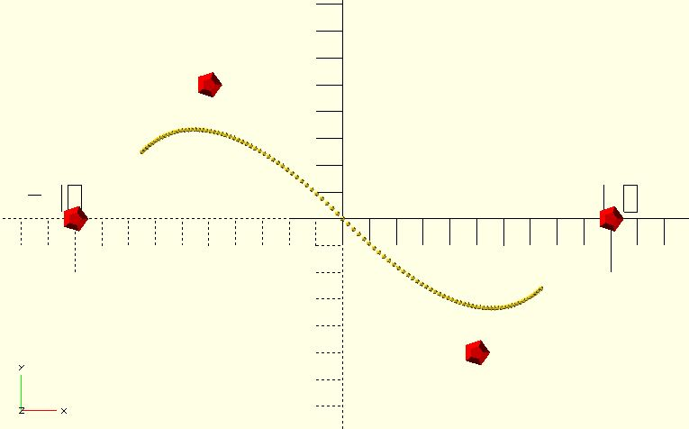

# bspline_curve

[B-spline](https://en.wikipedia.org/wiki/B-spline) interpolation using [de Boor's algorithm](https://en.wikipedia.org/wiki/De_Boor%27s_algorithm). This function returns points of the B-spline path. 

**Since:** 2.1

## Parameters

- `t_step` : The increment amount along the curve in the [0, 1] range.
- `degree` : The degree of B-spline. Must be less than or equal to `len(points) - 1`.
- `points` : A list of `[x, y]` or `[x, y, z]` control points. 
- `knots` : The knot vector. It's a non-decreasing sequence with length `len(points) + degree + 1`. If not provided, a uniform knot vector is generated automatically.
- `weights` : The weights of control points. If not provided, the weight of each point is 1.

## Examples

    use <bspline_curve.scad>
    
	points = [
		[-10, 0],
		[-5,  5],
		[ 5, -5],
		[ 10, 0]
	];

	color("red") for(p = points) {
		translate(p) 
			sphere(0.5);
	}

    // knots: [0, 1, 2, 3, 4, 5, 6]
	// weights: [1, 1, 1, 1]
	for(p = bspline_curve(0.01, 2, points)) {
		translate(p) 
			sphere(0.1);
	}

    use <bspline_curve.scad>
    
	points = [
		[-10, 0],
		[-5,  5],
		[ 5, -5],
		[ 10, 0]
	];

    // a non-uniform B-spline curve
    knots = [0, 1/8, 1/4, 1/2, 3/4, 4/5, 1];
    
	color("red") 
	for(p = points) {
		translate(p) 
			sphere(0.5);
	}

	for(p = bspline_curve(0.01, 2, points, knots)) {
		translate(p) 
			sphere(0.1);
	}

	use <bspline_curve.scad>
		
	points = [
		[-10, 0],
		[-5,  5],
		[ 5, -5],
		[ 10, 0]
	];

	// For a clamped B-spline curve, the first `degree + 1` and the last `degree + 1` knots must be identical.
	knots = [0, 0, 0, 1, 2, 2, 2];

	color("red") 
	for(p = points) {
		translate(p) 
			sphere(0.5);
	}

	for(p = bspline_curve(0.01, 2, points, knots)) {
		translate(p) 
			sphere(0.1);
	}

