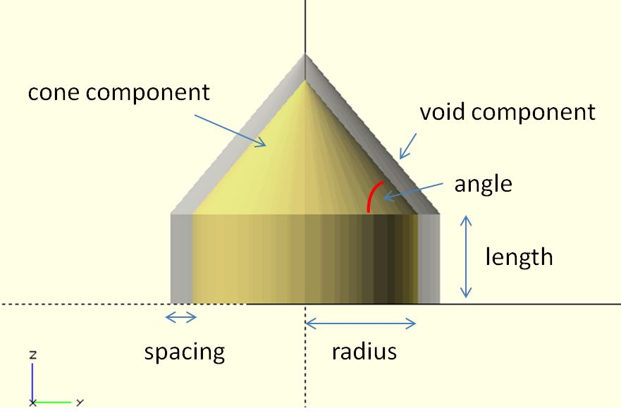

# cone

Create a cone for rotatable models.

**Since:** 2.1

## Parameters

- `radius` : The radius of the cone.
- `length` : The length of the cone.
- `spacing` : The spacing between the cone and void component. Default to `0.5`.
- `angle` : The angle between the bottom and hypotenuse. Default to `50` degree.
- `void` : The void component for differencing. It's used to create a cavity for a cone. Default to `false`.
- `ends` : Default to `false`. To create a double-ended cone, set it to `true`.

## Examples

	use <part/cone.scad>

	radius = 2.5;
    length = 2;
	spacing = 0.5;

	$fn = 48;

	cone(
		radius = radius, 
		spacing = spacing,
        length = 2
	);

	%cone(
		radius = radius, 
		spacing = spacing,
        length = 2,		
        void = true
	);

	use <part/cone.scad>

	radius = 2.5;
    length = 2;
	spacing = 0.5;

	$fn = 48;

	cone(
		radius = radius, 
		spacing = spacing,
        length = 2,
        ends = true
	);

	%cone(
		radius = radius, 
		spacing = spacing,
        length = 2,		
        void = true,
        ends = true
	);

