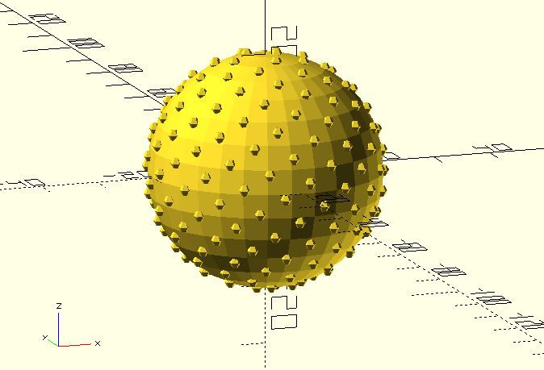
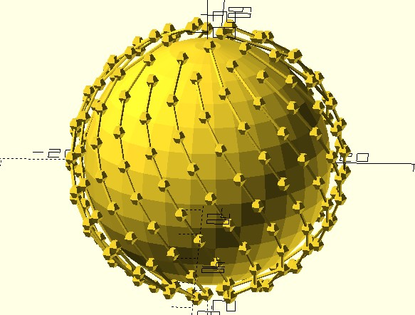

# fibonacci_lattice

Creates visually even spacing of n points on the surface of the sphere. Nearest-neighbor points will all be approximately the same distance apart. 

(It's called "visually even spacing" because only the vertices of the 5 [Platonic solids](https://en.wikipedia.org/wiki/Platonic_solid) can be said to be truly evenly spaced around the surface of a sphere.)

**Since:** 2.5

## Parameters

- `n` : The number of points.
- `radius` : The sphere radius. Default to 1.
- `rt_dir` : `"CT_CLK"` for counterclockwise. `"CLK"` for clockwise. The default value is `"CT_CLK"`.

## Examples

    use <fibonacci_lattice.scad>

    n = 200;
    radius = 20;
    pts = fibonacci_lattice(n, radius);

    for(p = pts) {
        translate(p)
            sphere(1);
    }
        
    sphere(radius);

    
    use <fibonacci_lattice.scad>
    use <polyline_join.scad>

    n = 200;
    radius = 20;
    pts = fibonacci_lattice(n, radius);

    for(p = pts) {
        translate(p)
            sphere(1);
    }

    sphere(radius * 0.9);

    // You can pick spirals from points.
    spirals = [for(j = [0:20]) 
        [for(i = j; i < len(pts); i = i + 21) pts[i]]
    ];

    for(spiral = spirals) {
        polyline_join(spiral)
            sphere(.25); 
    }
        
