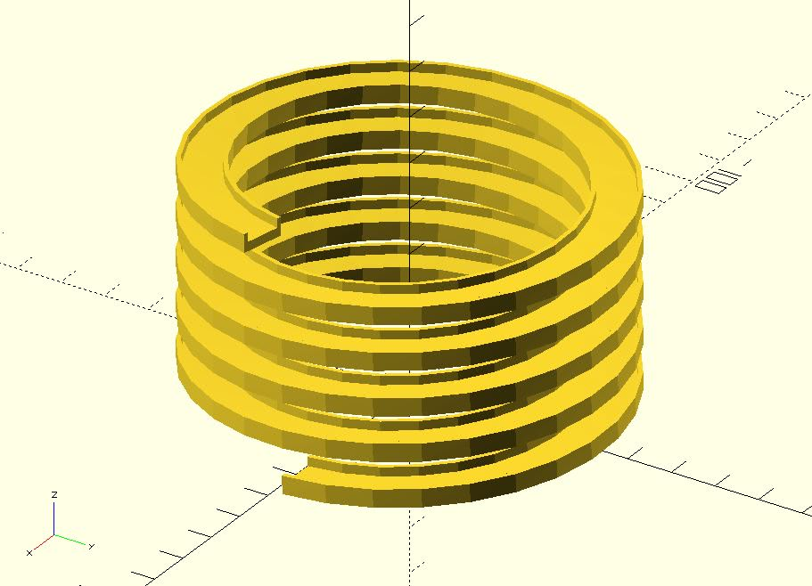

# helix_extrude

Extrudes a 2D shape along a helix path. 

When using this module, you should use points to represent the 2D shape. If your 2D shape is not solid, indexes of triangles are required. See [sweep](https://openhome.cc/eGossip/OpenSCAD/lib3x-sweep.html) for details.

Its `$fa`, `$fs` and `$fn` parameters are consistent with the `cylinder` module. 

## Parameters

- `shape_pts` : A list of points represent a shape. See the example below.
- `radius` : The radius of the cylinder. The radius of the cylinder. It also accepts a vector `[r1, r2]`. `r1` is the bottom radius and `r2` is the top radius of a cone.
- `levels` : The level count is performed every 360 degrees. 
- `level_dist` : The distance between two vertial points.
- `vt_dir` : `"SPI_DOWN"` for spiraling down. `"SPI_UP"` for spiraling up. The default value is `"SPI_DOWN"`.
- `rt_dir` : `"CT_CLK"` for counterclockwise. `"CLK"` for clockwise. The default value is `"CT_CLK"`.
- `twist` : The number of degrees of through which the shape is extruded.
- `scale` : Scales the 2D shape by this value over the length of the extrusion. Scale can be a scalar or a vector.
- `triangles` : `"SOLID"` (default), `"HOLLOW"` or user-defined indexes. See [sweep](https://openhome.cc/eGossip/OpenSCAD/lib3x-sweep.html) for details.
- `$fa`, `$fs`, `$fn` : Check [the cylinder module](https://en.wikibooks.org/wiki/OpenSCAD_User_Manual/Primitive_Solids#cylinder) for more details.

## Examples
    
	use <helix_extrude.scad>

	shape_pts = [
		[5, -2],
		[5, 2], 
		[4, 2],
		[4, 0],
		[-4, 0],
		[-4, 2],    
		[-5, 2],    
		[-5, -2]
	];

	helix_extrude(shape_pts, 
		radius = 40, 
		levels = 5, 
		level_dist = 10,
		vt_dir = "SPI_UP"
	);

	use <helix_extrude.scad>

	r1 = 40;
	r2 = 20;
	levels = 5;
	level_dist = 10;

	shape_pts = [
		[10, -2],
		[10, 2],
		[9, 2],
		[9, 0],
		[1, 0],
		[1, 2],
		[0, 2],
		[0, -2],
	];

	helix_extrude(shape_pts, 
		radius = [r1, r2], 
		levels = levels, 
		level_dist = level_dist,
		vt_dir = "SPI_UP"
	);

	%cylinder(h = levels * level_dist, r1 = r1, r2 = r2);

