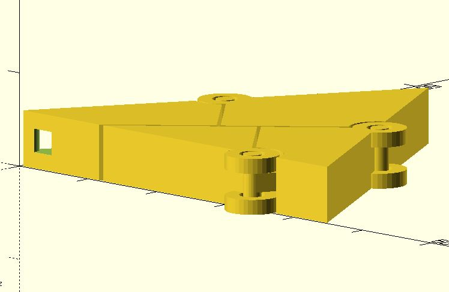
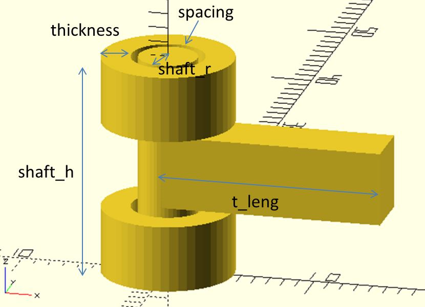

# joint_T

Create a joint_T for rotatable models.

**Since:** 2.1

## Parameters

- `shaft_r` : The shaft radius of the joint_T.
- `shaft_h` : The height of the shaft.
- `t_leng` : The length of the T part.
- `thickness` : The thicnkess of the ring.
- `spacing` : The spacing between the shaft and the ring. Default to `0.5`.
- `center` : `false` (default) for z ranges from 0 to `shaft_h`. `true` for z ranges from `-shaft_h / 2` to `shaft_h / 2`.

## Examples

	use <part/joint_T.scad>

	$fn = 48;

	joint_T(
		shaft_r = 2,
		shaft_h = 15,
		t_leng = 15,
		thickness = 2,
		spacing = 0.5
	);

