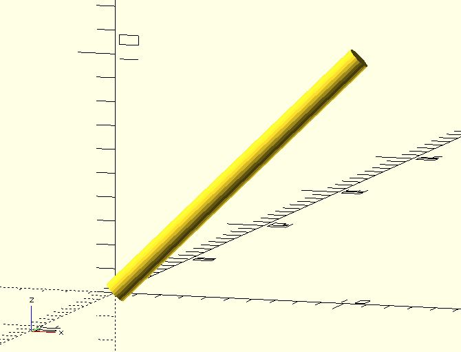
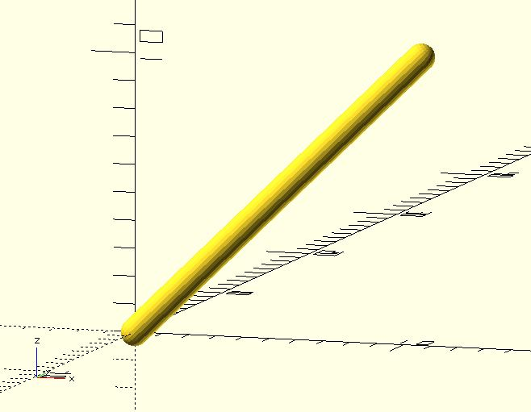

# line3d

Creates a 3D line from two points. 

## Parameters

- `p1` : 3 element vector `[x, y, z]`.
- `p2` : 3 element vector `[x, y, z]`.
- `diameter` : The line diameter. Default to 1.
- `p1Style` : The end-cap style of the point `p1`. The value must be `"CAP_BUTT"`, `"CAP_CIRCLE"` or `"CAP_SPHERE"`. The default value is `"CAP_CIRCLE"`. 
- `p2Style` : The end-cap style of the point `p2`. The value must be `"CAP_BUTT"`, `"CAP_CIRCLE"` or `"CAP_SPHERE"`. The default value is `"CAP_CIRCLE"`. 
- `$fa`, `$fs`, `$fn` : Used by the `circle` or `sphere` module internally. Check [the circle module](https://en.wikibooks.org/wiki/OpenSCAD_User_Manual/Using_the_2D_Subsystem#circle) or [the sphere module](https://en.wikibooks.org/wiki/OpenSCAD_User_Manual/Primitive_Solids#sphere) for more details. The final fragments of a circle will be a multiple of 4 to fit edges.

## Examples

    use <line3d.scad>
    
	line3d(
	    p1 = [0, 0, 0], 
	    p2 = [10, 2, 10], 
	    diameter = 1,
        $fn = 24
	);   

    use <line3d.scad>
	
	line3d(
	    p1 = [0, 0, 0], 
	    p2 = [10, 2, 10], 
	    diameter = 1, 
	    p1Style = "CAP_BUTT", 
	    p2Style = "CAP_BUTT",
        $fn = 24
	);   

			   
    use <line3d.scad>
    
    line3d(
        p1 = [0, 0, 0], 
        p2 = [10, 2, 10], 
        diameter = 1, 
	    p1Style = "CAP_SPHERE", 
	    p2Style = "CAP_SPHERE",
        $fn = 24
    );   

