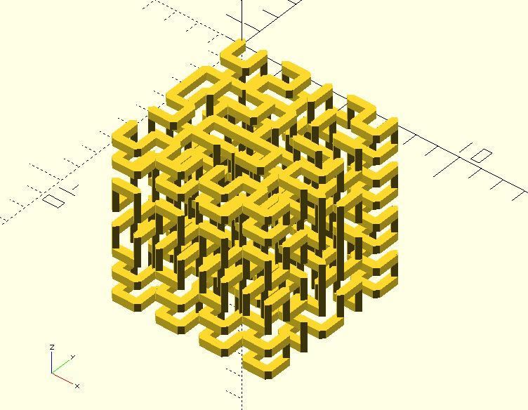
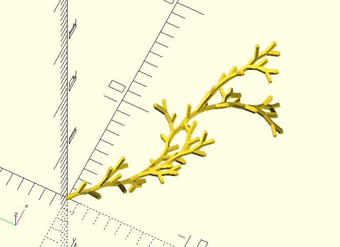
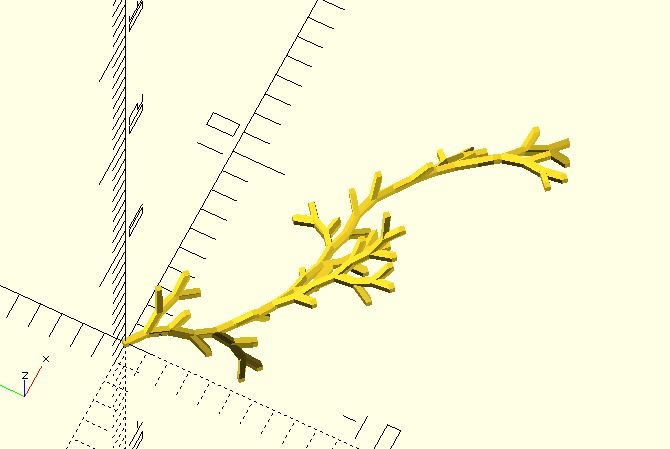

# lsystem3

`lsystem3` is a 3D implementation of [L-system](https://en.wikipedia.org/wiki/L-system). It's based on the algorithm of turtle grahpics. Instructions for generation of rules are as follows:

	F  Move forward and draw line
	f  Move forward without drawing a line
	+  Turn left
	-  Turn right
	|  Reverse direction (ie: turn by 180 degrees)
	&  Pitch down
	^  Pitch up
	\  Roll left
	/  Roll right       
	[  Push current turtle state onto stack
	]  Pop current turtle state from the stack

**Since:** 2.4

## Parameters

- `axiom` : The initial state of the system.
- `rules` : A list of production rules. The first element of each rule is the predecessor, and the second is the successor.
- `n` : Iteration times.
- `angle` : Used when turing.
- `leng` : Used when forwarding. Default to `1`.
- `heading` : The initial angle of the turtle. Default to `0`.
- `start` : The starting point of the turtle. Default to `[0, 0]`.
- `forward_chars` : Chars used for forwarding after the last iteration. Default to `'F'`. 
- `rule_prs` : The probabilities for taking rules. If each rule is chosen with a certain probability, it's a stochastic L-system. Each probability value for a rule ranges from 0 to 1.
- `seed` : Optional. Seed value for random number generator for repeatable results. **Since:** 3.3.

## Examples

[lsystem3-collections.scad](https://github.com/JustinSDK/dotSCAD/blob/master/examples/turtle/lsystem3_collection.scad) collects several L-system grammars. Here's one of them.

	use <turtle/lsystem3.scad>
	use <polyline_join.scad>

	for(line = hilbert_curve()) {
		polyline_join([line[0], line[1]])
		    sphere(.25, $fn = 4);
	}  

	function hilbert_curve(n = 3, angle = 90, leng = 1, heading = 0, start = [0, 0, 0]) = 
		let(
			axiom = "A",
			rules = [
				["A", "B-F+CFC+F-D&F^D-F+&&CFC+F+B//"],
				["B", "A&F^CFB^F^D^^-F-D^|F^B|FC^F^A//"],
				["C", "|D^|F^B-F+C^F^A&&FA&F^C+F+B^F^D//"],
				["D", "|CFB-F+B|FA&F^A&&FB-F+B|FC//"]
			]
		)
		lsystem3(axiom, rules, n, angle, leng, heading, start);  

    // a stochastic L-system

	use <turtle/lsystem3.scad>
	use <polyline_join.scad>

	for(line = vine()) {
		polyline_join([line[0], line[1]])
		    sphere(.25, $fn = 4);
	}  

	function vine(n = 3, angle = 18, leng = 1, heading = 0, start = [0, 0, 0]) = 
		let(
			axiom = "--F",
			rules = [
				["F", "/F[++F]-\\F[--F]+//F"]
			]
		)
		lsystem3(axiom, rules, n, angle, leng, heading, start, rule_prs = [0.8]);  

