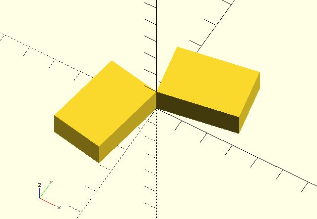

# m_mirror

Generate a 4x4 transformation matrix which can pass into `multmatrix` to mirror the child element on a plane through the origin. 

**Since:** 1.1

## Parameters

- `v` : The normal vector of a plane intersecting the origin through which to mirror the object.

## Examples

	use <matrix/m_mirror.scad>

	rotate([0, 0, 10]) 
		cube([3, 2, 1]);
		
	multmatrix(m_mirror([1, 1, 0]))
	rotate([0, 0, 10]) 
		cube([3, 2, 1]);

