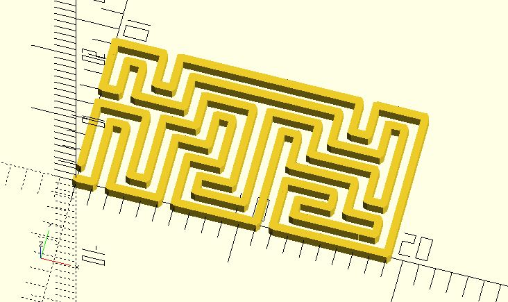

# mz_hamiltonian

Creates a hamiltonian path from a maze. The path is the result of maze traversal using [Wall follower](https://en.wikipedia.org/wiki/Maze_solving_algorithm#Wall_follower).

**Since:** 2.5

## Parameters

- `rows` : The rows of a maze.
- `columns` : The columns of a maze.
- `start` : The start point to travel the maze. Default to `[0, 0]`.
- `init_cells` : You can define your own initial cell data, a 2-dimension list of `[x, y, type, visited]`. `visited` means the cell is visited or not. A visited cell won't be visited when traveling the maze. If you don't provide `init_cells`, `mz_square` will generate one automatically. If you provide `init_cells`, `rows` and `columns` will be ignored. **Since:** 3.3
- `seed` : The maze is traveling randomly. Use `seed` to initialize the pseudorandom number generator.

## Examples
    
    use <maze/mz_hamiltonian.scad>
    use <polyline_join.scad>

    rows = 5;
    columns = 10;

    path = mz_hamiltonian(rows, columns, [0, 0]);
    polyline_join(path)
	    circle(.25);

The [senbon_torii](https://github.com/JustinSDK/dotSCAD/blob/master/examples/maze/senbon_torii.scad) is based on `mz_hamiltonian`.

