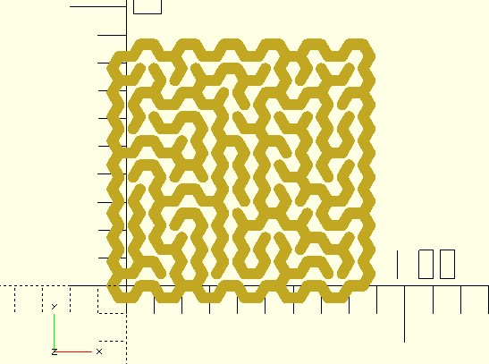

# mz_hexwalls

It's a helper for creating wall data from maze cells. You can transform wall points for creating different types of mazes.

**Since:** 3.3

## Parameters

- `cells` : Maze cells.
- `cell_radius` : The radius of a cell.
- `left_border` : Default to `true`. Create the leftmost border of the maze.
- `bottom_border` : Default to `true`. Create the bottommost border of the maze.

## Examples
    
	use <maze/mz_square.scad>
	use <maze/mz_hexwalls.scad>
	use <polyline_join.scad>

	rows = 10;
	columns = 12;
	cell_width = 5;
	wall_thickness = 2;

	cells = mz_square(rows, columns);
	walls = mz_hexwalls(cells, cell_width);

	for(wall = walls) {
		polyline_join(wall) 
		    circle(wall_thickness, $fn = 24);
	}
	
