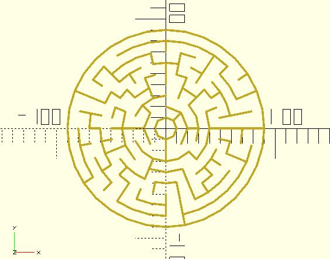

# mz_theta_get

It's a helper for getting data from a theta-maze cell.

**Since:** 3.0

## Parameters

- `cell` : A maze cell.
- `query` : Accepts `"r"`, `"c"` or `"t"`. `"r"` for the cell's `ri`. `"c"` for the cell's `ci` coordinate. `"t"` for the cell's `type`. The returned type will be `"NO_WALL"`, `"INWARD_WALL"`, `"CCW_WALL"` or `"INWARD_CCW_WALL"`.

## Examples
    
	use <maze/mz_theta_cells.scad>
	use <maze/mz_theta_get.scad>
	use <polyline_join.scad>

	rows = 8;
	beginning_number = 8;
	cell_width = 10;
	wall_thickness = 2;

	function vt_from_angle(theta, r) = [r * cos(theta), r * sin(theta)];

	maze = mz_theta_cells(rows, beginning_number);
	for(rows = maze, cell = rows) {
		ri = mz_theta_get(cell, "r");
		ci = mz_theta_get(cell, "c");
		type = mz_theta_get(cell, "t");
		thetaStep = 360 / len(maze[ri]);
		innerR = (ri + 1) * cell_width;
		outerR = (ri + 2) * cell_width;
		theta1 = thetaStep * ci;
		theta2 = thetaStep * (ci + 1);
		
		innerVt1 = vt_from_angle(theta1, innerR);
		innerVt2 = vt_from_angle(theta2, innerR);
		outerVt2 = vt_from_angle(theta2, outerR);
		
		if(type == "INWARD_WALL" || type == "INWARD_CCW_WALL") {
			polyline_join([innerVt1, innerVt2])
				circle(wall_thickness / 2);
		}

		if(type == "CCW_WALL" || type == "INWARD_CCW_WALL") {
			polyline_join([innerVt2, outerVt2])
				circle(wall_thickness / 2);
		}
	}

	thetaStep = 360 / len(maze[rows - 1]);
	r = cell_width * (rows + 1);
	for(theta = [0:thetaStep:360 - thetaStep]) {
		vt1 = vt_from_angle(theta, r);
		vt2 = vt_from_angle(theta + thetaStep, r);
		polyline_join([vt1, vt2])
			circle(wall_thickness / 2);
	} 

