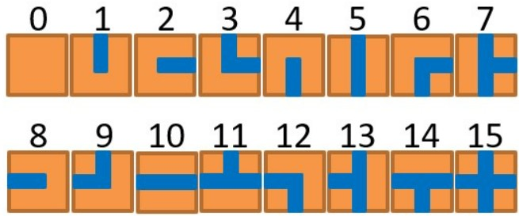
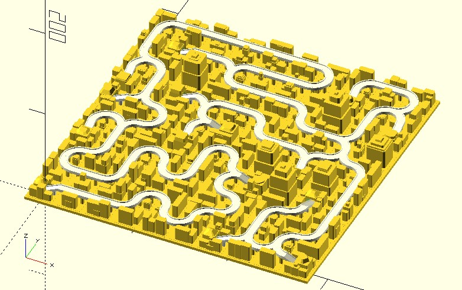

# mz_tiles

It turns maze cells into tiles. The retured tiles have a data structure `[x, y, n]`, where `n` is a tile index 0 ~ 15 of the tileset.

Just replace the tiles with your own path designs.

**Since:** 3.3

## Parameters

- `cells` : Maze cells.
- `left_border` : Default to `true`. Create the leftmost border of the maze.
- `bottom_border` : Default to `true`. Create the bottommost border of the maze.

## Examples
    
	use <maze/mz_square.scad>
	use <maze/mz_tiles.scad>

	rows = 10;
	columns = 10;

	cells = mz_square(rows, columns);

	tiles = mz_tiles(cells);

	tile_width = 30;
	for(tile = tiles) {
		translate([tile.x, tile.y] * tile_width)
			tile(tile[2], tile_width);
	}

	module tile(type, width) {
		// true 表示該方向有通道
		roads = [
			[false, false, false, false],
			[true, false, false, false],
			[false, true, false, false],
			[true, true, false, false],
			[false, false, true, false],
			[true, false, true, false],
			[false, true, true, false],
			[true, true, true, false],
			[false, false, false, true],
			[true, false, false, true],
			[false, true, false, true],
			[true, true, false, true],
			[false, false, true, true],
			[true, false, true, true],
			[false, true, true, true],
			[true, true, true, true]
		];

		difference() {
			square(width, center = true);
		
			for(i = [0:3]) {
				if(roads[type][i]) {
					rotate(-90 * i)
					translate([-width / 4, -width / 4])
						square([width / 2, width]);
				}
			}
		}
	}

An advanced model.

