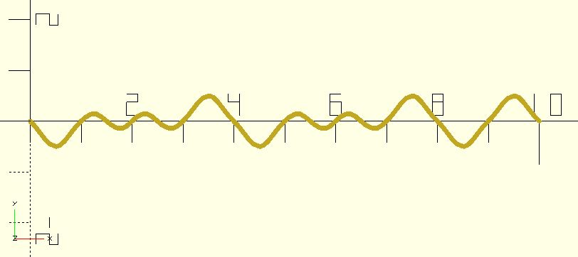

# nz_perlin1s

Returns 1D [Perlin noise](https://en.wikipedia.org/wiki/Perlin_noise) values at x coordinates.

**Since:** 2.3

## Parameters

- `xs` : The x coordinate.
- `seed` : The random seed. If it's ignored, a randomized value will be used.

## Examples

    use <polyline_join.scad>
    use <noise/nz_perlin1s.scad>

    xs = [for(x = [0:.1:10]) x];
    ys = nz_perlin1s(xs);
    points = [for(i = [0:len(xs) - 1]) [xs[i], ys[i]]];

    polyline_join(points)
	    circle(.05);

