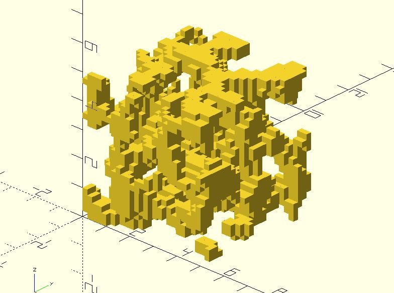

# nz_perlin3

Returns the 3D [Perlin noise](https://en.wikipedia.org/wiki/Perlin_noise) value at the (x, y, z) coordinate.

**Since:** 2.3

## Parameters

- `x` : The x coordinate.
- `y` : The y coordinate.
- `z` : The z coordinate.
- `seed` : The random seed.

## Examples

    use <util/rand.scad>
    use <noise/nz_perlin3.scad>

    seed = rand(0, 255);
    noised = [
        for(z = [0:.2:5], y = [0:.2:5], x = [0:.2:5])
        [x, y, z, nz_perlin3(x, y, z, seed)]
    ];    

    for(nz = noised) {
        if(nz[3] > 0.2) {
            translate([nz.x, nz.y, nz.z])
                cube(.2);
        }
    }

