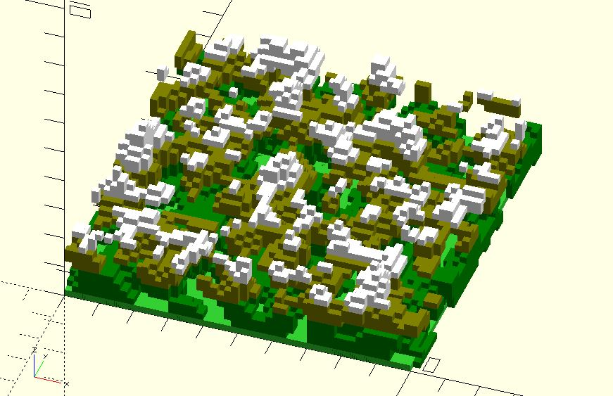

# nz_perlin3s

Returns 3D [Perlin noise](https://en.wikipedia.org/wiki/Perlin_noise) values at (x, y, z) coordinates.

**Since:** 2.3

## Parameters

- `points` : A list of `[x, y, z]` coordinates.
- `seed` : The random seed. If it's ignored, a randomized value will be used.

## Examples

    use <util/rand.scad>
    use <noise/nz_perlin2s.scad>
    use <noise/nz_perlin3s.scad>

    points = [
        for(y = [0:.2:10])
            [
                for(x = [0:.2:10])
                [x, y]
            ]
    ];

    seed = rand(0, 256);

    points_with_h = [
            for(ri = [0:len(points) - 1])
            let(ns = nz_perlin2s(points[ri], seed))
            [
                for(ci = [0:len(ns) - 1])
                    [points[ri][ci][0], points[ri][ci][1], ns[ci] + 1]
            ]
        ];

    h_scale = 1.5;
    for(row = points_with_h) {        
        for(i = [0:len(row) - 1]) {
            p = row[i];
            pts = [
                for(z = [0:.2:p[2] * h_scale]) [p.x, p.y, z]
            ];
            noise = nz_perlin3s(pts, seed);
            for(j = [0:len(pts) - 1]) {
                if(noise[j] > 0) {
                    color(
                        pts[j][2] < 1 ? "green" : 
                        pts[j][2] < 1.5 ? "Olive" : "white")
                    translate(pts[j])
                        cube(.2);
                }           
            }
        }
    }

    color("LimeGreen")
    linear_extrude(.2)
        square(10);

