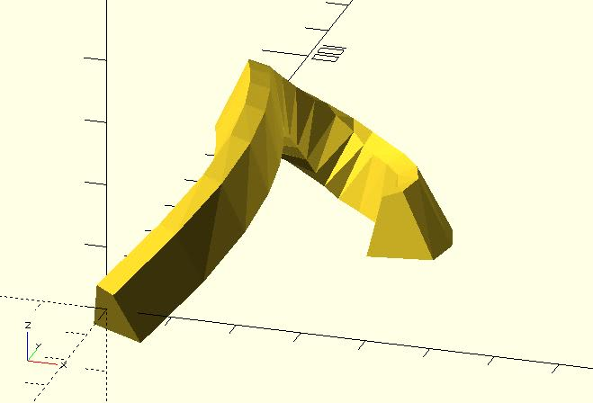

# path_extrude

It extrudes a 2D shape along a path. This module is suitable for a path created by a continuous function.

When using this module, you should use points to represent the 2D shape. If your 2D shape is not solid, indexes of triangles are required. See [sweep](https://openhome.cc/eGossip/OpenSCAD/lib3x-sweep.html) for details.

## Parameters

- `shape_pts` : A list of points represent a shape. See the example below.
- `path_pts` : A list of points represent the path.
- `triangles` : `"SOLID"` (default), `"HOLLOW"` or user-defined indexes. See example below.
- `twist` : The number of degrees of through which the shape is extruded.
- `scale` : Scales the 2D shape by this value over the length of the extrusion. Scale can be a scalar or a vector.
- `closed` : If the first point and the last point of `path_pts` has the same coordinate, setting `closed` to `true` will connect them automatically.  
- `method` : Which method  does `path_extrude` take to **guess** how to generate sections? It accepts two value, `"AXIS_ANGLE"` (default) and `"EULER_ANGLE"`. **Since:** 1.3.

## Examples

	use <path_extrude.scad>
	use <bezier_curve.scad>

	t_step = 0.05;
	width = 2;

	p0 = [0, 0, 0];
	p1 = [40, 60, 35];
	p2 = [-50, 70, 0];
	p3 = [20, 150, -35];
	p4 = [30, 50, -3];

	shape_pts = [   
		[5, -5],
		[3, 4],
		[0, 5],
		[-5, -5] 
	];

	path_pts = bezier_curve(t_step, 
		[p0, p1, p2, p3, p4]
	);

	path_extrude(shape_pts, path_pts);

	use <path_extrude.scad>
	use <bezier_curve.scad>

	t_step = 0.05;

	p0 = [0, 0, 0];
	p1 = [40, 60, 35];
	p2 = [-50, 70, 0];
	p3 = [20, 150, -35];
	p4 = [30, 50, -3];

	shape_pts = [
		// outer
		[5, 0],
		[3, 9],
		[0, 10],    
		[-5, 0],
		// inner
		[3, 2],
		[2, 7],
		[0, 7],
		[-3, 2]
	];

	path_pts = bezier_curve(t_step, 
		[p0, p1, p2, p3, p4]
	);

	path_extrude(shape_pts, path_pts, triangles = "HOLLOW");

	use <path_extrude.scad>
	use <bezier_curve.scad>
	
	t_step = 0.05;
	
	p0 = [0, 0, 0];
	p1 = [40, 60, 35];
	p2 = [-50, 70, 0];
	p3 = [20, 150, -5];
	p4 = [50, 50, -3];
	
	shape_pts = [
	    // outer
        [10, 0],
        [-5, 10],
	    [-10, 0],
	    // inner
        [7, 1],
        [-4, 8],
	    [-7, 1]
	];
	
	path_pts = bezier_curve(t_step, 
	    [p0, p1, p2, p3, p4]
	);
	
	path_extrude(
	    shape_pts, 
	    path_pts, 	   
	    triangles = [
            [0, 4, 3],
            [0, 1, 4],
            [1, 5, 4],
            [1, 2, 5],
            [2, 3, 5],
            [2, 0, 3]
        ]
	);

## About `path_extrude` (Important!!)

**`path_extrude` is actually a workaround when you have/provide only path points.**

If you want to extrude a shape along a path precisely, providing enough information about how to rotate sections is necessary. If you want to extrude a shape along a helix, `helix_extrude` is more suitable because it knows how to dig out necessary data for rotating sections precisely.

	use <helix_extrude.scad>

	shape_pts = [
		[0,0],
		[3, 1],
		[0, 2]
	];

	helix_extrude(shape_pts, 
		radius = 5, 
		levels = 5, 
		level_dist = 3,
		vt_dir = "SPI_UP"
	);

If you have only points, what `path_extrude` can do is to **guess** data about rotations. The different algorithm will dig out different data. For example:

	use <helix.scad>
	use <path_extrude.scad>

	shape_pts = [
		[0,0],
		[3, 1],
		[0, 2]
	];

	points = helix( 
		radius = 5, 
		levels = 5, 
		level_dist = 3,
		vt_dir = "SPI_UP"
	);

	path_extrude(shape_pts, points);

You might think this is wrong. Actually, it's not. It's the correct/default behavior of `path_extrude`. Because **you don't provide other information**, what `path_extrude` can do is to **guess** how to generate sections from points. You think it's a bug in `path_extrude` because your brain has information that path points do not provide.

 The `method` parameter is default to `"AXIS_ANGLE"`, a way to guess information from points. It accepts `"EULER_ANGLE"`, too. 

	use <helix.scad>
	use <path_extrude.scad>

	shape_pts = [
		[0,0],
		[3, 1],
		[0, 2]
	];

	points = helix( 
		radius = 5, 
		levels = 5, 
		level_dist = 3,
		vt_dir = "SPI_UP"
	);

	path_extrude(shape_pts, points, method = "EULER_ANGLE");

`"EULER_ANGLE"` generates the same section at the same point. You might think the model is correct. But, that's because what it guesses from points just match your expectation. 

`"EULER_ANGLE"` will generate an abrupt when the path is exactly vertical. [The problem happened in (older) Blender, too.](https://download.blender.org/documentation/htmlI/ch09s04.html) 

	use <path_extrude.scad>

	shape_pts = [[5, -5], [5, 5], [-5, 5], [-5, -5]];

	path_pts = [
		[20, 20, 0], 
		[18.2, 18.2, 2], 
		[16.8, 16.8, 4], 
		[15.8, 15.8, 6], 
		[15.2, 15.2, 8], 
		[15, 15, 10], 
		[15.2, 15.2, 12], 
		[15.8, 15.8, 14], 
		[16.8, 16.8, 16], 
		[18.2, 18.2, 18], 
		[20, 20, 20]
	];

	path_extrude(shape_pts, path_pts, method = "EULER_ANGLE");

The problem doesn't happen when `method` is `"AXIS_ANGLE"`.

	use <path_extrude.scad>

	shape_pts = [[5, -5], [5, 5], [-5, 5], [-5, -5]];

	path_pts = [
		[20, 20, 0], 
		[18.2, 18.2, 2], 
		[16.8, 16.8, 4], 
		[15.8, 15.8, 6], 
		[15.2, 15.2, 8], 
		[15, 15, 10], 
		[15.2, 15.2, 12], 
		[15.8, 15.8, 14], 
		[16.8, 16.8, 16], 
		[18.2, 18.2, 18], 
		[20, 20, 20]
	];

	path_extrude(shape_pts, path_pts, method = "AXIS_ANGLE");

So, which is the correct method? Both methods are correct when you provide only points. `method` is just a way you tell `path_extrude` how to guess more information when extruding. 

`"EULER_ANGLE"` will generate an abrupt when the path is exactly vertical. Some users might think it's a bug so `"AXIS_ANGLE"` is the default value. 

`"EULER_ANGLE"`, however, generates the same section at the same point. This means that you don't have to adjust sections if you want to extrude along a closed path. It's an advantage when extruding. For example:

	use <shape_pentagram.scad>
	use <path_extrude.scad>
	use <torus_knot.scad>

	p = 2;
	q = 3;
	phi_step = 0.05;
	star_radius = 0.5;

	pts = torus_knot(p, q, phi_step);

	shape_pentagram_pts = shape_pentagram(star_radius);

	// not closed perfectly
	translate([-8, 0, 0]) 
		path_extrude(
			shape_pentagram_pts, 
			[each pts, pts[0]], 
			closed = true,
			method = "AXIS_ANGLE"
		);

	// adjust it 
	path_extrude(
		shape_pentagram_pts, 
		[each pts, pts[0]], 
		closed = true,
		twist = 188,
		method = "AXIS_ANGLE"
	);

	// "EULER_ANGLE" is easy in this situation
	translate([0, 8, 0]) 
		path_extrude(
			shape_pentagram_pts, 
			[each pts, pts[0]], 
			closed = true,
			method = "EULER_ANGLE"
		);

	

Both methods are useful. If `"AXIS_ANGLE"` doesn't guess out what you want, choose `"EULER_ANGLE"`, and vice versa.

For more information, see [#issue 3](https://github.com/JustinSDK/dotSCAD/issues/3) and [#issue 5](https://github.com/JustinSDK/dotSCAD/issues/5).